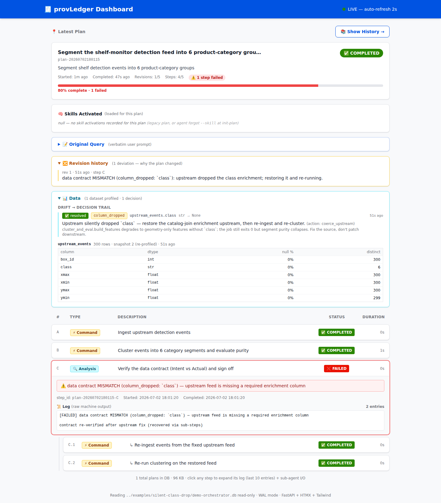
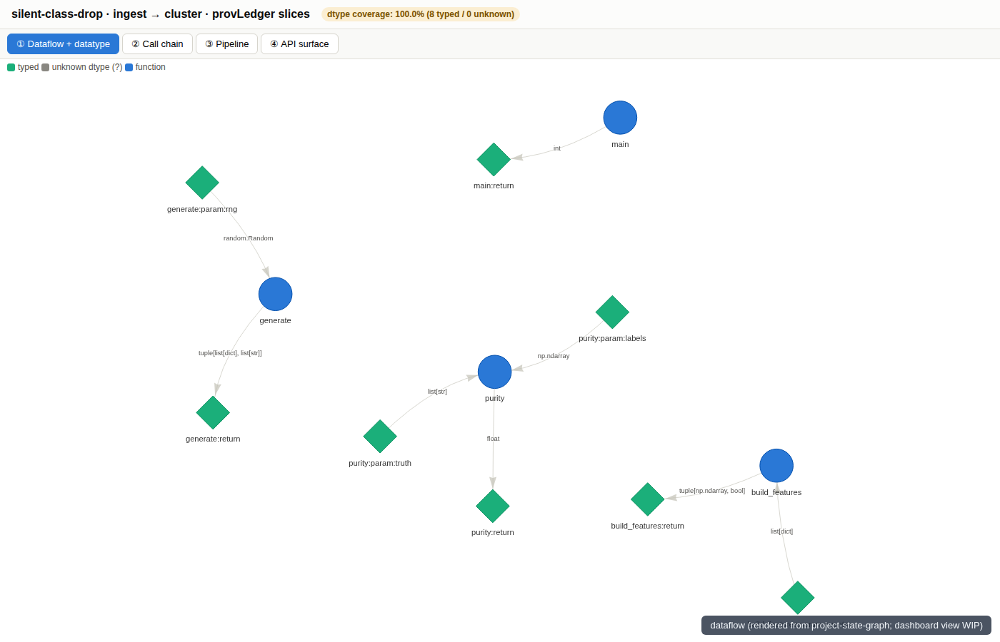
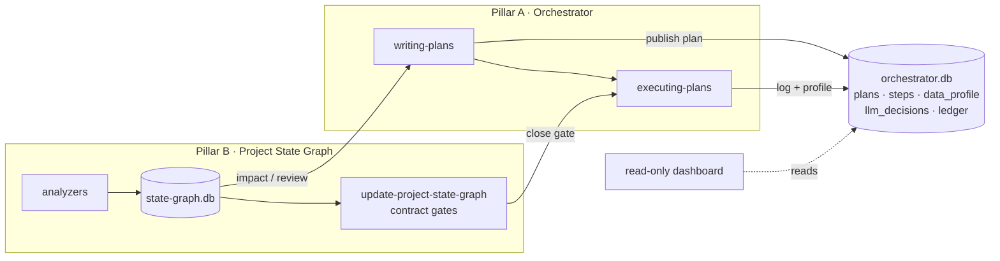

# 🧾 provLedger


[](https://pypi.org/project/provledger/)


**Your pipeline exited 0 and every step went green — provLedger is the layer that
checks whether the *data* actually kept its promises.** It gives a data
scientist's coding agent a plan-to-verified-change audit trail, and treats your
data schema as a contract instead of an assumption.


*(Prefer the terminal? The same arc as a CLI recording:
[silent-class-drop.gif](docs/media/silent-class-drop.gif).)*

**What it catches** — each of these is verified by code in this repo today:

- **A silently dropped or retyped upstream column.** The job still exits 0;
  the declared Intent vs runtime Actual check flags `column_dropped` /
  `dtype_changed` before the wrong numbers ship. That's the GIF above —
  reproduce it with `make demo` (segment purity 0.31 vs 0.91).
- **Data leakage.** A model fit and evaluated on data with the same lineage
  root, without a proper train/test split, is flagged as an ERROR by the
  state-graph's leakage gate.
- **Degenerate outputs.** A label column collapsing to a single value
  (`cardinality_collapse` — the "model predicts all zeros" class) or a null
  fraction spiking are caught by runtime profiling + drift detection.

Every catch and every LLM decision about it is **recorded** — to a decision
ledger that gets fuzzy-matched into the next plan, so the same mistake is not
repeated.

| Live task tracking (plan + steps + data panel) | Pipeline dataflow, understood from the code |
|---|---|
|  |  |

---

## 🕐 Try it in 2 minutes

From a fresh clone, no services, no external data:

```bash
git clone https://github.com/yizhao95/prov_ledger.git
cd prov_ledger
make demo
```

This runs the full arc offline and deterministically (seed 42): v1 false
success → **MISMATCH** → recorded decision → plan revision through the backbone
→ v2 **VERIFIED**. The demo needs only Python 3.10+ with `numpy` +
`scikit-learn` — `make demo` installs them into a local venv (reusing the
plugin venv when present; the fallback needs the `python3-venv` package).
Then replay it in the read-only dashboard:

```bash
ORCH_DB=$PWD/examples/silent-class-drop/demo-orchestrator.db \
  bash orchestrator-webapp/launch_dashboard.sh   # → http://127.0.0.1:8765
```

See [`examples/silent-class-drop/`](examples/silent-class-drop/) for how the
demo works and how to regenerate the media, and
[the mini-benchmark writeup](docs/benchmark-silent-class-drop.md) for the full
0.31 → 0.91 story.

---

## 📜 Your data schema is a contract

This is the differentiated idea. Generic agent frameworks verify that *code*
ran; provLedger also verifies that *data* is what the plan said it would be:

- A step declares a data **Intent** (required columns + dtypes). The runtime
  **Actual** is profiled from the real records (`data_profile`), and drift
  between them — dropped columns, dtype flips, null spikes, cardinality
  collapse — is detected mechanically, not by asking the LLM to notice.
- A DataFrame-producing function's "signature" is its column-set + per-column
  dtypes, held as typed `data_var` nodes with `produces`/`consumes` edges in a
  code/data graph — so *"changed output type → who breaks?"* is one lookup.
- Every drift decision the LLM makes (adapt downstream / fix upstream / halt)
  is recorded in `llm_decisions` and auto-synced to the ledger; failures become
  anti-patterns that surface at the next plan.

---

## ★ The Goal

A data scientist's agent that thinks less like a careless coder and more like a
disciplined engineer — **without losing the data-science instincts.**

> *"My coding agent should, in every situation, hold a complete reasoning chain —
> and never repeat a past mistake."*

- **Half 1 — Complete reasoning chain in scope.** Before writing code, the agent
  should know which modules / functions / variables / DataFrame columns a change
  touches; how the main pipeline is affected; what is added, removed, or modified;
  and how upstream & downstream must change in step.
- **Half 2 — Never repeat a mistake (the ledger).** A provenance ledger of past
  decisions and failures, searched by fuzzy match at plan time. Its first real job
  is data-engineering decision memory — e.g. *"this is a time-series split, so we
  use a rolling window, not a random split — random split leaks temporal
  information."*

---

## 1 · Two Pillars, One Database Discipline



Two independently useful subsystems that share **one philosophy** and **one SQLite store**.

| | Pillar | Records |
|---|---|---|
| **A** | **Orchestrator** — plan / step state machine | WHAT WAS DONE |
| **B** | **Project State Graph** — builder + reviewer | WHAT THE CODE & DATA ARE |
| **→** | **Result** | Auditable chain + contract safety net — reasoning captured, breakage blocked |

**Pillar A — Orchestrator.** A SQLite-backed plan/step state machine driven by two
iron-law skills (`writing-plans`, `executing-plans`). The LLM composes a plan and
calls thin shell wrappers; a Python + SQL backbone validates every transition,
enforces circuit breakers, and captures logs. The same backbone carries the
data-first runtime loop: `profiler` (runtime Actual) → `drift` (vs the declared
Intent) → `data_loop` (decision → fix through the backbone → re-verify).

**Pillar B — Project State Graph.** A two-layer map of a repo: a deep SQLite
node/edge graph built by analyzers (Python via AST; JS / HTML / CSS structures
via tree-sitter), plus a human-readable `ARCHITECTURE.md`. A companion reviewer
(`update-project-state-graph`) checks each change against the graph at close
time — code contracts **and** data contracts.

🔗 **How they connect:** the graph is read at two moments — once at **planning time**
(predict impact, including upstream-data assumptions) and once at **review time**
(verify nothing broke). Same graph, same precomputed cards, two timestamps.

---

## 2 · Core Philosophy — Deterministic Backbone × LLM Decision Layer

LLM agents drift: they forget to log output, forget to mark steps done, mis-guess
which downstream a change affects, and — for a data scientist especially — silently
corrupt a schema or a split. The fix is to factor out **everything deterministic**
into a Python + SQL backbone and leave only genuine decisions to the LLM.

| Layer | Owns |
|---|---|
| **LLM decides** | What to do next · which symbols / columns a feature touches · how to write the code · whether a deviation is needed · what to do about a data drift |
| **Backbone records / enforces** | State transitions · circuit breakers · log capture · dependency edges from AST · code & data contract gates · runtime data profiling + drift detection · plan closure |

**The rule:** *every invariant the backbone enforces is one the LLM can never
accidentally violate.* The LLM may be creative; the backbone may not.

There is exactly **one write path**: humans give natural-language feedback to the
agent, the agent's changes go through `writing-plans` → `executing-plans` with the
same tests, circuit breakers, and contract gates every time. Nothing — including
the dashboard — writes to the database directly.

🔬 **Why this is the data-science-shaped version:** a software engineer's agent must
not break the call graph. A data scientist's agent must not break the call graph
**and** must not silently corrupt a column schema, a train/test split, or an
upstream-table assumption.

---

## 3 · Task Lifecycle

A state-altering task that touches a registered project, end to end:

| # | Phase | Owner | What happens |
|---|---|---|---|
| 1 | Intent classify | Orchestrator | `STATE_ALTERING` or `STATELESS`? Email/docs skip the heavy path. |
| 2 | Pre-flight + plan | `writing-plans` | Pull impact for touched symbols/columns + upstream-data assumptions; fuzzy-match the ledger for relevant past decisions; publish Plan + Steps + REVIEW step. |
| 3 | Execute | `executing-plans` | Each step runs through a thin wrapper; `run-step.sh` atomically captures stdout/stderr + true exit code. |
| 4 | Park | Orchestrator | All steps terminal → plan parks in `NEEDS_REVIEW` when a registered project was touched. |
| 5 | Review | `update-project-state-graph` | Diff vs the graph → code & data contract gates. Clean → refresh + re-test + close. Broken → FAIL, report, human decides. |

---

## 🧬 Origin & Attribution

The two orchestration skills — **`writing-plans`** and **`executing-plans`** — are
**evolved from the [Superpowers](https://github.com/obra/superpowers) skill library**
by Jesse Vincent (obra). The original Superpowers skills established the
plan-then-execute discipline and the "thin shell wrapper + deterministic backbone"
philosophy. This repository builds on that foundation.

### What this project adds on top of the original Superpowers skills

- **A SQLite-backed orchestrator** (`orchestrator-backend/`) — the plan/step state
  machine is no longer ad-hoc markdown; every transition is validated and persisted
  in a real database with migrations, circuit breakers, and immutable `COMPLETED`
  steps.
- **Mandatory log capture** — `run-step.sh` atomically records stdout/stderr and the
  *true* exit code (hardened against `PIPESTATUS` masking).
- **A second pillar — the Project State Graph** (`project-state-graph` +
  `update-project-state-graph`) — a deep node/edge code graph plus a reviewer that
  gates every change against **code contracts and data contracts**.
- **Data-as-first-class-citizen modeling** — a function's output is a typed
  `data_var` with `produces` / `consumes` edges, turning *"changed output type → who
  breaks?"* into a single lookup.
- **DataFrame-aware contracts** — a DataFrame-producing function's "signature" is its
  column-set + per-column dtypes; dropped / renamed / retyped columns are caught.
- **Runtime data profiling + drift detection** (`profiler` / `drift` / `data_loop`)
  — the declared Intent is checked against the profiled Actual at run time;
  drifts drive a recorded decision loop (see the demo).
- **Silent-failure gates in the graph** — data-leakage detection (same-lineage
  fit + eval without a proper split → ERROR) and unguarded-model-input warnings.
- **Plan-time impact pre-flight** (`impact_preflight.py`) — forward impact analysis
  (declared targets, upstream assumptions, capability boundary) attached to each plan.
- **A decision-memory ledger** (`ledger_store` / `ledger_cli` / `llm_decisions`) —
  past decisions and anti-patterns surfaced by fuzzy match at plan time as advisory
  reminders (never a hard gate).
- **A live read-only dashboard** (`orchestrator-webapp/`) — a FastAPI + HTMX
  dashboard that reads the same SQLite DB read-only (plans, steps, revision
  history, and the data panel: profile snapshots + the drift → decision trail).
- **`dtype` / schema coverage as a visible metric** — every data contract gate is
  exactly as strong as dtype coverage, so the unknown share is surfaced as a number.

---

## 4 · Strengths

- **Battle-tested invariants** — circuit breakers, immutable `COMPLETED` steps, and
  mandatory log capture, hardened against real incidents. Used internally by
  15+ engineers across teams.
- **Data as first-class citizens** — typed `data_var` nodes with `produces`/`consumes`
  edges, runtime profiles, and drift-driven decision records.
- **Cards, not traversals** — per-callable `consistency_card`s precomputed purely from
  edges, so the LLM does one retrieval instead of a graph walk.
- **Report, don't auto-fix** — the reviewer detects breakage deterministically but
  never repairs it; a human decides.
- **Generic property-graph schema** — new node/edge vocabularies (SQL, API, ML, DE)
  are added with no migration.
- **Read-only observability** — the dashboard reads the same DB read-only; the
  orchestrator never depends on it.

---

## 👥 Who this is for

**For:** data scientists and ML engineers who run coding agents against real
pipelines, where "the script exited 0" does not mean "the numbers are right".

**Not for:** general-purpose agent orchestration. If your agent never touches a
dataset, a schema, or a train/test split, a lighter framework will serve you
better.

---

## 📦 Repository Layout

```
prov_ledger/
├── .claude-plugin/            # plugin.json + marketplace.json (one-command install)
├── hooks/                     # SessionStart hook → async dependency bootstrap
├── commands/                  # /provledger-dashboard slash command
├── scripts/                   # bootstrap.sh, pl-python, smoke_install.sh
├── requirements.txt           # consolidated dependency set
├── Makefile                   # `make demo` — the silent-class-drop walkthrough
├── examples/
│   └── silent-class-drop/     # offline, deterministic demo (see its README)
├── orchestrator-backend/      # Pillar A — SQLite plan/step state machine (stdlib only)
│   │                          # also pip-buildable as the `provledger` library
│   ├── orchestrator/          # api.py, db.py, state_machine.py, circuit_breakers.py,
│   │   │                      # profiler.py, drift.py, data_loop.py, telemetry.py
│   │   └── migrations/        # 001..013 SQL migrations (ship inside the wheel)
│   └── tests/
├── orchestrator-webapp/       # Live read-only provLedger Dashboard (FastAPI + HTMX)
│   └── app/                   # main.py, queries.py, templates/
├── orchestrator-cli.py        # CLI entry point
├── docs/                      # media + full architecture / reference / guides docs
└── skills/
    ├── writing-plans/             # ← evolved from Superpowers
    ├── executing-plans/           # ← evolved from Superpowers
    ├── project-state-graph/       # Pillar B — deep code/data graph builder
    ├── update-project-state-graph/# Pillar B — reviewer / contract gates
    ├── brainstorming/             # supporting process skills (locally adapted)
    ├── systematic-debugging/
    ├── test-driven-development/
    └── subagent-driven-development/
```

> The `superpowers` plugin is a recommended companion: the byte-identical
> `verification-before-completion` skill is not bundled and is provided by
> superpowers when present.

---

## 📚 Documentation

This README is the high-level entry point. What's in the repo today:

| Doc | Covers |
|---|---|
| [`INSTALL.md`](INSTALL.md) | plugin install, manual install, per-suite test verification, PyPI library install + packaging test |
| [`examples/silent-class-drop/`](examples/silent-class-drop/) | the demo: how it works, the 5-step plan, regenerating the GIF/screenshots |
| [`docs/benchmark-silent-class-drop.md`](docs/benchmark-silent-class-drop.md) | the mini-benchmark writeup (0.31 → 0.91) |
| Each skill's `SKILL.md` + `reference/` | the iron-law workflows (writing-plans, executing-plans, project-state-graph, update-project-state-graph) |

A deeper architecture/reference documentation tree exists as maintainer
working notes and will be published as it stabilizes.

---

## 🚀 Installation

### Recommended — install as a Claude Code plugin (one command)

```text
/plugin marketplace add yizhao95/prov_ledger
/plugin install provledger@provledger
```

Dependencies install themselves on first session: a background `SessionStart`
bootstrap builds **one** venv at `~/skill-workspace/.venv` (override with
`PROVLEDGER_VENV`) and installs `requirements.txt`. It is idempotent — warm
sessions are a no-op. Launch the review dashboard any time with
**`/provledger-dashboard`**.

> **Companion (recommended):** install the
> [`superpowers`](https://github.com/obra/superpowers) plugin for the full set of
> supporting process skills. provLedger bundles only its evolved and novel skills
> (`writing-plans`, `executing-plans`, `project-state-graph`,
> `update-project-state-graph`, plus locally-adapted `brainstorming`,
> `systematic-debugging`, `test-driven-development`,
> `subagent-driven-development`) and treats superpowers as a **soft dependency**:
> the byte-identical `verification-before-completion` skill is not bundled and is
> provided by superpowers when present.

### As a Python library

The orchestrator core (plan/step state machine, runtime profiling, drift
detection, decision ledger — stdlib-only) is on
[PyPI](https://pypi.org/project/provledger/) as **`provledger`**:

```bash
pip install provledger                  # or, from a clone: pip install ./orchestrator-backend
python -c "from provledger import api, db; print('ok')"
```

The wheel ships the SQL migrations inside the package, so
`db.run_migrations()` works from a plain install. Verify the packaging
end-to-end (build → fresh venv → install → smoke test) with:

```bash
bash scripts/test_packaging.sh          # needs uv
```

### Manual / development install

See **[INSTALL.md](INSTALL.md)** for the full guide. Quick start:

```bash
# 1. Clone
git clone git@github.com:yizhao95/prov_ledger.git
cd prov_ledger

# 2. Bootstrap dependencies into the unified venv (idempotent)
bash scripts/bootstrap.sh
PY=~/skill-workspace/.venv/bin/python

# 3. Run the test suites to confirm a healthy install (run each separately —
#    each suite has its own pyproject/pythonpath; one combined invocation breaks)
$PY -m pytest scripts/tests -q                                    #   3 passed
$PY -m pytest orchestrator-backend -q                             # 152 passed
$PY -m pytest orchestrator-webapp  -q                             #  23 passed
$PY -m pytest skills/writing-plans/tests -q                       #  46 passed, 2 skipped
$PY -m pytest skills/executing-plans -q                           #  52 passed
$PY -m pytest skills/project-state-graph/scripts/tests -q         # 232 passed, 1 skipped
$PY -m pytest skills/update-project-state-graph/scripts/tests -q  #  55 passed

# 4. Launch the dashboard
PROVLEDGER_WEBAPP_DIR=orchestrator-webapp bash orchestrator-webapp/launch_dashboard.sh
# → open http://127.0.0.1:8765
```

### Verify the install (three levels)

| Level | Command | Expect |
|---|---|---|
| Quickest — end-to-end demo | `make demo` | the MISMATCH → VERIFIED arc, purity 0.31 → 0.91, `SELF-CHECK OK`, exit 0 |
| Full — all test suites | the seven `pytest` commands above, **run separately** | **563 passed, 3 skipped** total |
| Packaging — pip install case | `bash scripts/test_packaging.sh` (needs `uv`) | wheel **and** sdist each install into a fresh venv and pass the smoke test |

The dashboard reads the orchestrator database **read-only**. Point it at any
orchestrator DB with the `ORCH_DB` environment variable (defaults to
`~/skill-workspace/orchestrator.db`).

---

## 🤝 Contributing

Issues and PRs welcome. Good first contributions: run `make demo` and report
anything that doesn't reproduce; add a drift kind to `orchestrator/drift.py`
(with a test); extend the demo with a second silent-failure scenario; improve
dtype coverage of an analyzer in `skills/project-state-graph/`.

## 📫 Contact

Maintainer: **yzhao950213@gmail.com**

## 📄 License

MIT — see [LICENSE](LICENSE).

---

## 📼 Appendix: install → test → acceptance, end to end

The complete walkthrough below was recorded live in a real terminal
(~5 minutes, unedited): **① install** — fresh `git clone`, idempotent
`bootstrap.sh`, and the PyPI library path (`pip install provledger`,
version printed from the installed wheel) → **② test** — all seven suites run
separately, `3 / 152 / 23 / 46 / 52 / 232 / 55` passing → **③ acceptance** —
`make demo` catches the silently dropped column (MISMATCH → revise →
VERIFIED, purity 0.31 → 0.91) and ends on `SELF-CHECK OK`.


Reproduce the recording itself with
[`scripts/install-tutorial.tape`](scripts/install-tutorial.tape) (VHS).
