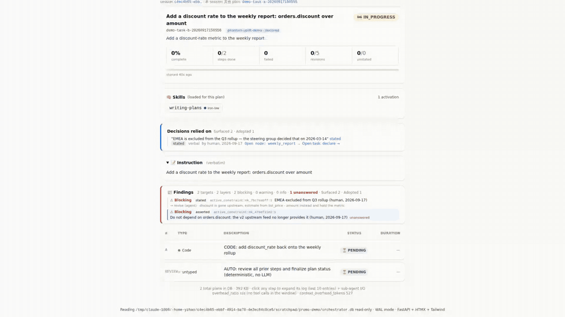
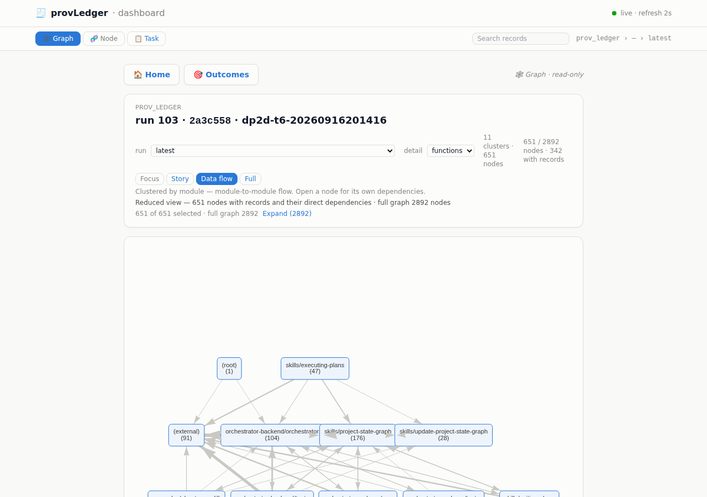

# provLedger

Lost in a project's decision history? Watching your coding agent walk the same wrong path again?

provLedger helps you remember what was decided, who said it, and why — and reminds the agent before it changes its mind.



*Task → "Decisions relied on" → open the node → the rule with the email → `/ledger`: "why did we stop using orders.discount?" → a cited answer.*

A Claude Code plugin that keeps the reasons behind a project's changes — your words, the email, the agent's reading, kept apart — and puts them in front of whoever is about to change the thing again.


[](https://pypi.org/project/provledger/)


---

## 1 · The problem

Three months ago someone said, in a meeting, "don't split that dataset randomly — it is a time series." Today a new teammate, or a coding agent, reads the odd-looking rolling-window split, finds no comment and no failing test, and cleans it up. Every test passes. The number on the quarterly deck quietly changes. Nobody knows why.

This is its own kind of failure, and the usual tools each miss it by one step. `git blame` gives you who and when. Lineage gives you where the column came from. An architecture decision record gives you the shape of the system. None of them connects the line you are looking at to the email, the meeting or the sentence that put it there — because the reason was never inside the code or the data in the first place.

*Some decisions only ever happened in one conversation. This gives them a timestamp, a record, and a voice.*

---

## 2 · What it does

### A project database with a full map and a full history



*Data flow, not a call graph: 2,892 nodes folded into 11 modules and laid out in three bands — what gets read on one side, what processes it in the middle, what comes out on the other. Only what has a story is drawn, and the page says how much it left out.*

Functions are the least of it. A column in a dataset is a thing in this map. So is a SQL table, a feed arriving from someone else's system, a metric you track, and anything you put there by describing it in a sentence. They are all first-class: each one has its own page, its own history and its own rules.

Nothing in it is registered by hand, and nothing in it is taken on the agent's word. The map is rebuilt from the source on every run and compared against the run before, so what changed is **measured**: this column is gone; that function returns a different shape; this one only moved to another file. It keeps hold of the same thing across renames and moves — matching on the name, on the shape of the code, on what flows through it, and on what owns it — so a tidy-up does not reset a thing's history, and when two candidates are genuinely indistinguishable it says so instead of guessing.

The arrows are computed the same way: what reads this table, what consumes this function's output, what a column ends up feeding. That is the part you cannot get from `git diff`, and it is what lets the tool answer *what might this break* before anything is edited. In the bundled demo an upstream supplier quietly stops sending the `discount` column. Nothing in the repository announces it — but the next run finds the column gone, and because the map already knows what reads that column and where those things lead, it can name the rollup three steps downstream and the revenue number on the end of it. That same computed blast radius is what the warning before an edit is reading, and what the second half of a plan's opening summary is made of.

That is *what changed*. The rest of the record is *why*: around each thing the map holds its history — what it was, what it became, the reason recorded at the time, the rule that still constrains it, and how far that reason can be checked, whether that is a link, a recorded sentence, or nothing at all. Every record is appended, never edited; a correction is a new row pointing at the old one, and the whole timeline is hash-chained and anchored in git.

### A dashboard a person can audit


*Graph, Node, Task — one anchor, three angles. One record per decision; a hit count, never a repeat.*

The dashboard is read-only and opens the database in read-only mode, so it can never block or change what it is showing. Graph draws the project as it is, or as it was at a chosen run, with a mark on everything that has a story. Node walks one thing's timeline: when it changed, why, who was shown which record, and which plan went on to cite it. Task shows what one piece of work read and what it decided. The three share one anchor — project, node, point in time — and switching views keeps it.

### Ask it


*Every sentence cites a record. When nothing is recorded, it says so.*

`/ledger why is our train/test split 80/20?` — the answer comes back in the session you are already in, and every sentence ends with the id of the record it rests on. Code finds the candidates, computes the facts and computes the absences; the model may only restate that table; then code reads the answer back and deletes any sentence that cites nothing, cites an id the table does not hold, or carries a number the table does not state — counting every deletion, so a trimmed answer never reads like a complete one. The same thing is a command (`provledger ask`) and a page (`/ledger?q=`).

### Things that were never in the code

Most of what decides a number never was in the repository: a steering group excluded a region, a feed comes from someone else's system, a figure was worked out by hand once. One sentence puts those in the same map, and nothing enters it until you say the words yourself.

```console
$ provledger node declare "EMEA excluded from Q3 rollup, decided in the March review" \
    --type stakeholder_decision --links-to pkg.rollup.weekly_report --attr decided_on=2026-03-14
draft 1: declared:emea-excluded-from-q3-rollup-decided-in-the …
  links declared_constrains -> pkg.rollup.weekly_report (user)
  nothing is in the graph yet. Confirm it with your own words:
  provledger node declare --confirm 1 --words "<the sentence you would say>" --at "<when it was decided>"
```

From then on it is an ordinary thing in the map: the next run computes its changes, it shows up in all three views, and a rule it carries turns up in the next plan that touches what it constrains.

---

## 3 · Five minutes

### Install

As a Claude Code plugin — this is the one that brings the hooks, the skills and the dashboard:

```bash
claude plugin marketplace add yizhao95/prov_ledger
claude plugin install provledger@provledger
```

Or as a Python library, if you only want the core to read and write a ledger from your own code:

```bash
pip install provledger
```

Dependencies install themselves on the first session. The full manual install, the per-suite verification and the troubleshooting table are in [`INSTALL.md`](INSTALL.md).

### Five commands

Each command below was run for real against a scratch ledger; the lines under it are what it printed.

**1 · Confirm the plugin is in.**

```console
$ claude plugin list
  ❯ provledger@provledger
    Version: 0.2.0
    Scope: user
    Status: ✔ enabled
```

**2 · Register a project.** This reads the repository into the map and writes the first run.

```console
$ bash skills/project-state-graph/scripts/init_project.sh \
    --name myproj --repo /tmp/myproj --out-dir /tmp/myproj-graph
    registered myproj -> /tmp/myproj-graph/myproj-state-graph.db
Self-check: PASS (/tmp/myproj-graph/myproj-state-graph.db)
```

**3 · Run one plan.** The bundled demo is the whole arc in miniature, on its own scratch project under `/tmp/provledger-demo`: a person removes a column and records why, with the email that carried it; then an agent plans to use that column again.

```console
$ bash examples/phantom-uplift/demo-provenance.sh
     2 findings unanswered · 2 records shown · 0 adopted
```

Both findings are the heads-up the second plan was given before it wrote a line — the rule against depending on the removed column, and the steering-group decision anchored on the same report. Neither blocks. The agent answers one of them, cites the record, and that citation is what gets written down.

**4 · Open the dashboard.** Read-only, on your machine, over the ledger you point it at.

```console
$ ORCH_DB=/tmp/provledger-demo/orchestrator.db PROVLEDGER_DASH_PORT=8766 \
    bash orchestrator-webapp/launch_dashboard.sh
🚀 Launching dashboard (PID 567189, log → /tmp/webapp-server.log)
✅ Dashboard ready at http://127.0.0.1:8766
```

The port is 8765 unless `PROVLEDGER_DASH_PORT` says otherwise. Inside a session, `/provledger-dashboard` does the same thing.

**5 · Ask one question.**

```console
$ provledger ask "why did we stop using orders.discount?" --no-model --project phantom-uplift-demo
`pkg.rollup.load_orders` has never been verified: no outcome is recorded for it in scope. [scope]
Scope: 3 nodes, 2 constraints, 0 influencing records, 6 changes, 2026-09-17 to 2026-09-17; 3 candidates, 3 chosen; nothing truncated. Computed in 0.0 s.
```

`--no-model` prints the computed facts, the computed absences and the scope, and says in one line that there is no summary. With a model it adds one paragraph restating that table, and nothing else.


*The whole answer, in the terminal you are already in — the facts, the absences, and the range that was searched.*

---

## 4 · How it works (the honest version)

### What is computed and what is said

Everything a node carries is labelled with where it came from. The label is decided by structure, not by whoever wrote the row, and a model cannot award itself one.

| tier | definition | what it requires |
|---|---|---|
| `observed` | computed from the analysis run — or read off a page by a person | an analysis run, or somebody who looked |
| `derived` | inferred by a rule, not measured | the id of the rule that fired, and its basis |
| `asserted` | the agent's reading, recorded as such | an interpretation or a statement |
| `stated` | the user's own words, with the span | a recorded utterance and a span inside it |
| `unstated` | nothing was recorded | no text at all |

Alongside the tier, each reason carries a *source level* computed from its links and never stored: `linked` (a reference with a uri), `verbal` (a quoted span, or a verbal source), `task_context` (only the plan, step, run and time it was recorded in), `unstated`. Every recorded reason is at least `task_context`, because it hangs on the plan that closed.

### Where it is kept

Two SQLite files. The **orchestrator database** (`ORCH_DB`, default `~/skill-workspace/orchestrator.db`) holds plans, steps, tool calls, the utterances, the references, the reasons (`change_reason`), the declared nodes, expectations and outcomes. The **project state graph** (one per registered project) holds the map and its per-run history. All the provenance tables are append-only: `DELETE` is refused, the only `UPDATE`s allowed are a `superseded_by` pointer and a reference's `last_checked`, and each table carries its own sha256 chain.

A ledger that only checks itself has checked nothing, so when a plan closes provLedger appends the chain heads to `git notes --ref provledger` on HEAD — a witness that lives in the repository, not in the database it vouches for.

```console
$ provledger verify --against-notes
chain change_reason: ok · 2308 row(s) walked · head #2308 7f1c05ab93d4
anchors: 2 anchor(s), 2 matched · latest note a91c4e7f0b22 @ 6744c800af13
These records existed at the anchored commit and have not been altered since.
That is not a claim that what they say happened.
```

`ok` and `anchored` stay two different words: a ledger nothing vouches for is still internally sound, and the report says why there is no witness rather than printing a quiet zero. A broken chain names the row and exits 3.

### The hooks

Five hooks, and they only ever add.

| hook | what it records |
|---|---|
| `SessionStart` | installs dependencies once, in the background |
| `UserPromptSubmit` | your prompt, verbatim, as one utterance attributed to the repo and the open plan |
| `PostToolUse` | one row per tool call, for the cost numbers below |
| `PreToolUse` (Edit / Write / MultiEdit) | injects the active constraints anchored on the lines about to change, and one hop downstream — at most 600 characters, and not one byte when nothing anchors there |
| `Stop` | closes the session record and refreshes the graph |

None of them blocks, executes or decides. The one exception is opt-in: a human constraint declared `"block": true` in your extensions file. The ledger records what it **showed** and what was **adopted** — a record cited by id in a headline response, a reason's `because`, or an acknowledged constraint.

> It cannot record that anyone **read** it, and it will not pretend a display count is a reading.

> The rules are deterministic and their basis is written down; when none applies the system asks, and when nobody answers it records `unstated` rather than inventing.

### What it costs

Measured from `tool_call_log` over completed plans and written to [`docs/perf-baseline.json`](docs/perf-baseline.json) (2026-09-16):

| | median | p90 | n |
|---|---|---|---|
| provenance share of a plan's tool calls | 0.0 % | 1.9 % | 8 plans |
| total orchestration + provenance overhead | 0.0 % | 4.4 % | 8 plans |
| extra context per plan | 0 tokens | 1,576 tokens | 102 plans |
| tool calls per step | 4.2 | 8.8 | 8 plans |

The thresholds are tests, not intentions: `test_h1_overhead_ratio` fails above 10 % provenance or 35 % total, `test_h4_context_overhead` fails above 3,000 tokens, `test_h1_threshold` fails when recent plans exceed 1.5 × the baseline's p90 calls per step. Each of them skips **out loud** when there is nothing to measure. The same file carries a hand-measured reference run with the plugin disabled — 5 tool calls, 10 assistant turns, 266,393 tokens on a three-step task — labelled in the file as "a reference number, never an assertion", because three runs of that task ranged 5 to 26 calls on permission friction alone.

A tool that fights silent failure must not fail silently.

---

## 5 · Extending it

### Your own node types

A node-type provider is a class. It gets a read-only view of the repository and returns observations; the host does the matching. This one is shipped as `provledger.testing.example_provider` and turns every Python file into one `module` node:

```python
from provledger.graph_api import MUTATIONS, NodeObservation, Signature

class ModuleProvider:
    type_id = "provledger.module_example"      # vendor.name, must match the registration
    schema_version = 1
    requires: tuple[str, ...] = ()

    def extract(self, ctx) -> list[NodeObservation]:
        out = []
        for rel in sorted(ctx.file_map):
            if not rel.endswith(".py"):
                continue
            name, sig, n_defs = analyse(ctx.repo_root, rel)   # your own parsing
            out.append(NodeObservation(
                type_id=self.type_id, node_type="module", qualified_name=name,
                file_path=rel, line_start=1, line_end=1,
                signatures=(Signature("qualname", name), Signature("struct", sig),
                            Signature("dataflow", None, trivial=True)),
                attrs={"n_defs": n_defs}))
        return out

    def attributes_schema(self):
        return {"required": ["n_defs"], "types": {"n_defs": "int"}}

    def declared_stability(self) -> dict[str, str]:
        return {m: "preserved" for m in MUTATIONS}
```

### The six contracts

`provledger.testing.conformance.run(YourProvider())` puts a provider through a mutation corpus and prints one line per contract:

| contract | what it demands |
|---|---|
| `determinism` | extracting the same repository twice gives byte-identical observations |
| `purity` | no write SQL, no file under the repository created or changed |
| `stability_matches_declaration` | for every mutation that reaches your nodes, what the host observes equals what `declared_stability()` claims |
| `schema` | namespaced `type_id`, valid attributes, known or `x-` layers |
| `failure_isolation` | an injected exception degrades you and nothing propagates or leaks |
| `performance_budget` | the slowest extraction stays inside `timeout_s` |

The point is honesty, not stability: a provider whose identity breaks on `rename_variable` passes as long as it says so. What fails is the lie — the package ships a `liar_provider` whose signature mixes the function name in while declaring `rename_function: preserved`, and the suite names the mutation that lied.

```console
$ python -c "from provledger.testing import conformance, example_provider; \
    print(conformance.run(example_provider.ModuleProvider()).text())"
Conformance: PASS
  [OK  ] determinism: 3 base(s) extracted twice, byte-identical (7 observations)
  [OK  ] purity: read-only graph, no write SQL, repository untouched
  [OK  ] stability_matches_declaration: declaration holds for ['change_attr', 'delete_function', 'extract_function', 'move_file', 'rename_function', 'rename_variable', 'swap_two_similar'] over 3 case(s)
  [OK  ] schema: type_id namespaced, attrs valid, layers known
  [OK  ] failure_isolation: an injected exception degrades the provider (empty), nothing propagates
  [OK  ] performance_budget: slowest base extraction 0.00s vs budget 30.0s
```

### Registering it

Everything third-party is declared in one file. The first of `<repo>/provledger-extensions.json`, `$PROVLEDGER_EXTENSIONS`, `~/skill-workspace/provledger-extensions.json` wins — they are never merged, and a malformed file is an error rather than a silent fallback.

```json
{
  "version": 1,
  "providers": [
    {"id": "acme.dataset_comments", "module": "acme_provider:DatasetComments", "priority": 5, "timeout_s": 30},
    {"id": "provledger.owned", "enabled": false}
  ],
  "drift_kinds": [
    {"id": "acme.null_spike_strict", "metric": "null_frac", "op": "delta_gte", "value": 0.1, "priority": 10}
  ],
  "namesets": [
    {"set": "split_funcs", "add": ["my_split", "time_split"]},
    {"set": "fit_methods", "add": ["fit_transform_all"], "remove": ["train"]}
  ],
  "outcome_channels": [
    {"id": "acme.ab_test", "module": "acme_channels:ABTestChannel", "priority": 5}
  ],
  "constraints": [
    {"project": "prov_ledger",
     "statement": "orders.region != 'X' must stay excluded",
     "subjects": ["pkg.pipeline.clean", "orders.region"],
     "why_ref": "https://wiki/decisions/42",
     "why_visibility": "restricted"}
  ]
}
```

Nothing here can raise at analysis time. An import that fails, a `type_id` that differs from its declared id, a timeout or a schema violation becomes a degradation record: the run continues without that provider, the analyzer prints `WARNING: provider <id> degraded: <reason>`, and `selfcheck` warns `providers_degraded`. Every run fingerprints the file it loaded, so a graph can be reproduced with the same extensions it was built with.

### Declaring the world outside the code

Five declared types — `external_system`, `business_rule`, `stakeholder_decision`, `external_dataset`, `manual_figure`. `declare()` has no tier parameter: a field you typed is `stated`, a field a model tidied out of your sentence is `asserted`, and a declared node is never `observed`, because nobody observed a meeting. A draft holds nothing until you confirm it in your own words.

```console
$ provledger node declare "EMEA excluded from Q3 rollup, decided in the March review" \
    --type stakeholder_decision --links-to pkg.rollup.weekly_report --attr decided_on=2026-03-14
draft 1: declared:emea-excluded-from-q3-rollup-decided-in-the (stakeholder_decision, tier stated)
  attrs {'decided_on': '2026-03-14'}
  links declared_constrains -> pkg.rollup.weekly_report (user)
  nothing is in the graph yet. Confirm it with your own words:
  provledger node declare --confirm 1 --words "<the sentence you would say>" --at "<when it was decided>"
```

A link naming something the graph does not have is refused, with the name that was wrong.

Deeper: [`docs/conformance.md`](docs/conformance.md) (providers and the six contracts), [`docs/extensions.md`](docs/extensions.md) (the whole file, discovery, priorities, reproducibility), [`docs/outcomes.md`](docs/outcomes.md) (expectations, the `profile_drift` and `metric:<name>` channels, third-party channels), [`docs/arbitration.md`](docs/arbitration.md) (the `Arbiter` interface and the numeric gate an arbiter must clear before it writes anything).

---

## 6 · Reference

### CLI

`provledger <command>` — generated from `--help`, one row per subcommand.

| command | what it does |
|---|---|
| `metrics plan` / `metrics baseline` | tool-call cost of one plan; median / p90 over completed plans |
| `note` | record something that was said, with the time it happened (`--node`, `--ref`, `--kind`) |
| `node declare` | turn one sentence into a declared node — a draft, until you confirm it in your own words |
| `node add` | a figure with no traceable data source (`--manual-figure`, `--value`, `--note`) |
| `node list` / `node show` / `node retire` | the project's declared nodes; every version of one; retire one (append-only) |
| `anchor` | pin a number in a deck, workbook or report to the node it is a reading of |
| `anchor check` | re-read the files; a lost anchor is reported, never re-pointed |
| `anchor candidates` | propose readings — off by default, and even on it only proposes |
| `headline show` / `respond` / `ack` | the plan headline; answer one finding (revise / proceed); a person proceeds past one |
| `why` | one bounded read of a node: history, constraints, rejected paths, prior claims, blast radius (`--impact`, `--all`, `--pending`, `--never-read`, `--search`, `--json`) |
| `ask` | ask the ledger a question (`--no-model`, `--json`, `--export`, `--lang`, `--runner`) |
| `verify` | walk the three hash chains, and with `--against-notes` the git anchors they must agree with (exit 3 on a broken chain) |
| `export` | a whitelisted bundle for someone who was not there (`--out`, `--zip`, `--include-rationale`, `--md`) |
| `init --agents-md` | write or refresh the provledger section of `./AGENTS.md` |
| `reason mark` | a person's word on a reason's significance, logged as judged by a human |
| `significance eval` / `disagreements` | manual: an LLM verdict on reasons that carry only a hint; where hint and verdict disagree |
| `reasons reclass-status` / `ask-basis` | migration state and tier counts; the close-time questions the rules did not recognise |

`export` never lets verbatim words out: a shareable record that quotes personal words keeps the record, drops the quotation and says which one it withheld; a rationale travels only when you name its id.

### Dashboard routes

Read-only, no non-GET route.

| route | shows |
|---|---|
| `/` | the live plan and its steps |
| `/plan/{id}?node=&at=` | one task: what it read, what it decided, its findings and outcomes |
| `/graph/{project}?focus=&at=&mode=story` | the project map, now or at a past run, marked where there is a story |
| `/node/{project}/{qualified_name}?at=` | one node's timeline, reasons, constraints and occurrences |
| `/session/{id}` | what one session said, cost and changed — with or without a plan |
| `/history` | past plans |
| `/search` | across plans, steps and records |
| `/ledger?q=` · `/ledger/results` · `/ledger/card` | ask a question; the answer; a markdown evidence card |
| `/outcomes?project=` | every claim with its latest outcome, tier, delta and who backfilled it |
| `/api/dashboard` · `/api/health` | the polled fragment; liveness |

### Tests

Seven suites, each with its own pyproject and pythonpath — run them separately.

| suite | tests |
|---|---|
| `scripts/tests` | 22 |
| `orchestrator-backend` | 751 |
| `orchestrator-webapp` | 260 |
| `skills/writing-plans/tests` | 93 |
| `skills/executing-plans` | 77 |
| `skills/update-project-state-graph/scripts/tests` | 90 |
| `skills/project-state-graph/scripts/tests` | 425 |

Total **1829 collected** across the eight suites (`scripts/count_tests.sh`), plus a few deselected (`llm_consistency` and the manual arbiter evaluations never run in CI). Commands and expected output: [`INSTALL.md` §5](INSTALL.md).

### Origin

The two orchestration skills, `writing-plans` and `executing-plans`, are evolved from the [Superpowers](https://github.com/obra/superpowers) skill library by Jesse Vincent (obra), which established the plan-then-execute discipline this repository builds on. What provLedger adds is the persistence and the provenance: a validated SQLite state machine instead of ad-hoc markdown, a project state graph with code and data contract gates, runtime profiling and drift detection, the decision ledger, and the read-only dashboard. provLedger also bundles local variants of six superpowers skills; [`INSTALL.md`](INSTALL.md) says how to choose between them in one project.

### Contributing

Issues and pull requests are welcome. Good first contributions: run `make demo` and report anything that does not reproduce; register a drift kind, a name set or a constraint in `provledger-extensions.json` for your own project; add a second silent-failure scenario to the demo; improve dtype coverage of an analyzer in `skills/project-state-graph/`. Maintainer: yzhao950213@gmail.com.

### More

| | |
|---|---|
| [`INSTALL.md`](INSTALL.md) | plugin install, manual install, the analyzer's own `uv` environment, per-suite verification, PyPI install, troubleshooting |
| [`docs/NORTH-STAR.md`](docs/NORTH-STAR.md) | the one sentence and the three cores every change is measured against |
| [`docs/decision-provenance.md`](docs/decision-provenance.md) | the tables, the tiers, the rules R0–R6, the headline, `/ledger`, verify and export, anchors, and the honest boundaries |
| [`docs/conformance.md`](docs/conformance.md) · [`docs/extensions.md`](docs/extensions.md) · [`docs/outcomes.md`](docs/outcomes.md) · [`docs/arbitration.md`](docs/arbitration.md) | writing providers, registering everything, outcome channels, identity arbitration |
| [`docs/design.md`](docs/design.md) | the dashboard's design system: one `tokens.json`, the component library, the wording table (English default, `?lang=zh`) |
| [`docs/benchmark-silent-class-drop.md`](docs/benchmark-silent-class-drop.md) | the mini-benchmark for the failure class: a silently dropped column, segment purity 0.31 against 0.91 on the same green pipeline |
| [`examples/phantom-uplift/`](examples/phantom-uplift/) | `make demo` — a revenue number that goes up for the wrong reason, caught offline and deterministically; plus the provenance demo used in section 3 and the anchor walkthrough |
| [`docs/KNOWN-ISSUES.md`](docs/KNOWN-ISSUES.md) | the confirmed defects and the standing limits, grouped by where you will hit them, with the workaround when there is one |
| [`CHANGELOG.md`](CHANGELOG.md) | what each phase and release added, 0.1.0 → 0.2.0 |
| [`LICENSE`](LICENSE) | MIT |

The `superpowers` plugin is a recommended companion: the byte-identical `verification-before-completion` skill is not bundled and comes from superpowers when present. Everything works without it.

The PyPI package is the stdlib-only core library — plans, steps, profiling, drift, the ledger — and the published release is 0.1.0; the plugin, the skills, the hooks, the dashboard and the `provledger` command come from this repository at 0.2.0.
