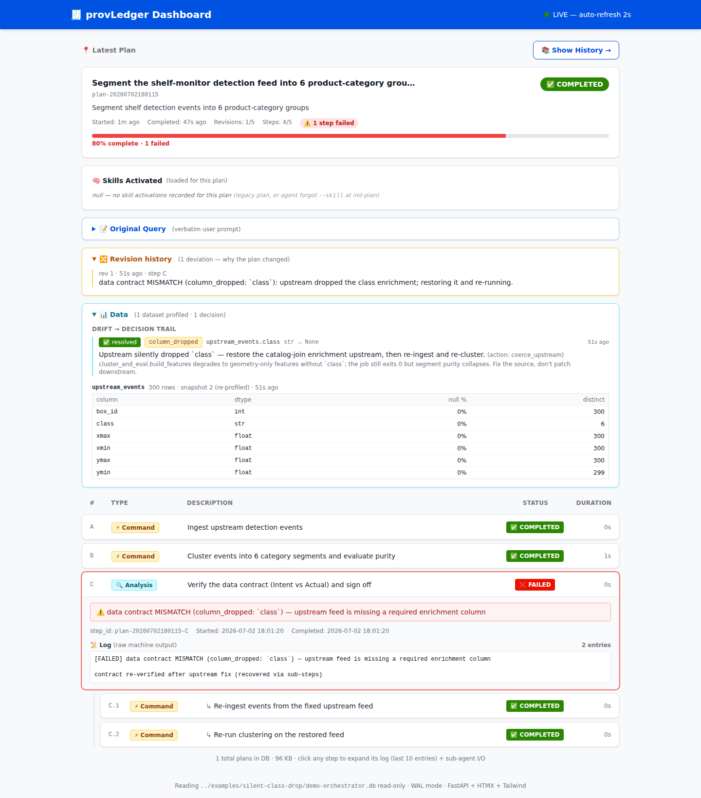
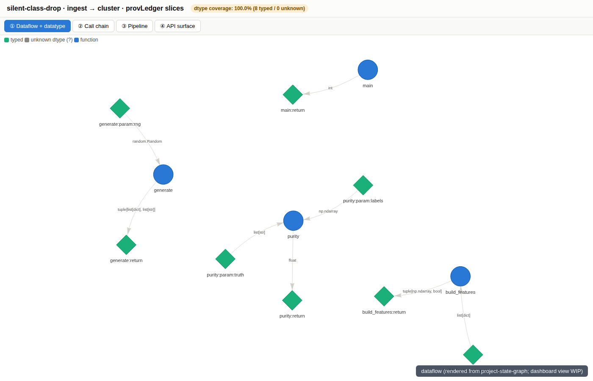
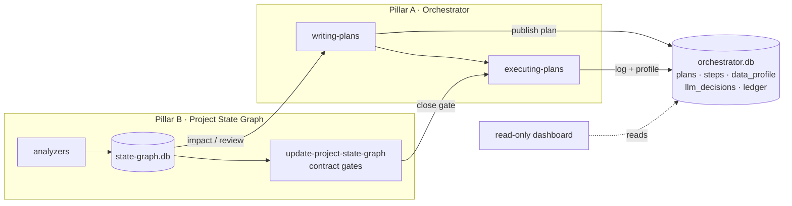

# 🧾 provLedger


[](https://pypi.org/project/provledger/)


**Your pipeline exited 0 and every step went green — provLedger is the layer that
checks whether the *data* actually kept its promises.** It gives a data
scientist's coding agent a plan-to-verified-change audit trail, and treats your
data schema as a contract instead of an assumption.


*(Prefer the terminal? The same arc as a CLI recording:
[silent-class-drop.gif](docs/media/silent-class-drop.gif).)*

**What it catches** — each of these is verified by code in this repo today:

- **A silently dropped or retyped upstream column.** The job still exits 0;
  the declared Intent vs runtime Actual check flags `column_dropped` /
  `dtype_changed` before the wrong numbers ship. That's the GIF above —
  reproduce it with `make demo` (segment purity 0.31 vs 0.91).
- **Data leakage.** A model fit and evaluated on data with the same lineage
  root, without a proper train/test split, is flagged as an ERROR by the
  state-graph's leakage gate.
- **Degenerate outputs.** A label column collapsing to a single value
  (`cardinality_collapse` — the "model predicts all zeros" class) or a null
  fraction spiking are caught by runtime profiling + drift detection.

Every catch and every LLM decision about it is **recorded** — to a decision
ledger that gets fuzzy-matched into the next plan, so the same mistake is not
repeated.

| Live task tracking (plan + steps + data panel) | Pipeline dataflow, understood from the code |
|---|---|
|  |  |

---

## 🕐 Try it in 2 minutes

From a fresh clone, no services, no external data:

```bash
git clone https://github.com/yizhao95/prov_ledger.git
cd prov_ledger
make demo
```

This runs the full arc offline and deterministically (seed 42): v1 false
success → **MISMATCH** → recorded decision → plan revision through the backbone
→ v2 **VERIFIED**. The demo needs only Python 3.10+ with `numpy` +
`scikit-learn` — `make demo` installs them into a local venv (reusing the
plugin venv when present; the fallback needs the `python3-venv` package).
Then replay it in the read-only dashboard:

```bash
ORCH_DB=$PWD/examples/silent-class-drop/demo-orchestrator.db \
  bash orchestrator-webapp/launch_dashboard.sh   # → http://127.0.0.1:8765
```

See [`examples/silent-class-drop/`](examples/silent-class-drop/) for how the
demo works and how to regenerate the media, and
[the mini-benchmark writeup](docs/benchmark-silent-class-drop.md) for the full
0.31 → 0.91 story.

---

## 📜 Your data schema is a contract

This is the differentiated idea. Generic agent frameworks verify that *code*
ran; provLedger also verifies that *data* is what the plan said it would be:

- A step declares a data **Intent** (required columns + dtypes). The runtime
  **Actual** is profiled from the real records (`data_profile`), and drift
  between them — dropped columns, dtype flips, null spikes, cardinality
  collapse — is detected mechanically, not by asking the LLM to notice.
- A DataFrame-producing function's "signature" is its column-set + per-column
  dtypes, held as typed `data_var` nodes with `produces`/`consumes` edges in a
  code/data graph — so *"changed output type → who breaks?"* is one lookup.
- Every drift decision the LLM makes (adapt downstream / fix upstream / halt)
  is recorded in `llm_decisions` and auto-synced to the ledger; failures become
  anti-patterns that surface at the next plan.

---

## ★ The Goal

A data scientist's agent that thinks less like a careless coder and more like a
disciplined engineer — **without losing the data-science instincts.**

> *"My coding agent should, in every situation, hold a complete reasoning chain —
> and never repeat a past mistake."*

- **Half 1 — Complete reasoning chain in scope.** Before writing code, the agent
  should know which modules / functions / variables / DataFrame columns a change
  touches; how the main pipeline is affected; what is added, removed, or modified;
  and how upstream & downstream must change in step.
- **Half 2 — Never repeat a mistake (the ledger).** A provenance ledger of past
  decisions and failures, searched by fuzzy match at plan time. Its first real job
  is data-engineering decision memory — e.g. *"this is a time-series split, so we
  use a rolling window, not a random split — random split leaks temporal
  information."*

---

## 1 · Two Pillars, One Database Discipline


```mermaid
flowchart LR
    subgraph A[Pillar A · Orchestrator]
        WP[writing-plans] --> EX[executing-plans]
    end
    subgraph B[Pillar B · Project State Graph]
        AN[analyzers] --> G[(state-graph.db)]
        G --> RV[update-project-state-graph<br/>contract gates]
    end
    DB[(orchestrator.db<br/>plans · steps · data_profile<br/>llm_decisions · ledger)]
    WP -- publish plan --> DB
    EX -- log + profile --> DB
    G -- impact / review --> WP
    RV -- close gate --> EX
    DASH[read-only dashboard] -.reads.-> DB
```

Two independently useful subsystems that share **one philosophy** and **one SQLite store**.

| | Pillar | Records |
|---|---|---|
| **A** | **Orchestrator** — plan / step state machine | WHAT WAS DONE |
| **B** | **Project State Graph** — builder + reviewer | WHAT THE CODE & DATA ARE |
| **→** | **Result** | Auditable chain + contract safety net — reasoning captured, breakage blocked |

**Pillar A — Orchestrator.** A SQLite-backed plan/step state machine driven by two
iron-law skills (`writing-plans`, `executing-plans`). The LLM composes a plan and
calls thin shell wrappers; a Python + SQL backbone validates every transition,
enforces circuit breakers, and captures logs. The same backbone carries the
data-first runtime loop: `profiler` (runtime Actual) → `drift` (vs the declared
Intent) → `data_loop` (decision → fix through the backbone → re-verify).

**Pillar B — Project State Graph.** A two-layer map of a repo: a deep SQLite
node/edge graph built by analyzers (Python via AST; JS / HTML / CSS structures
via tree-sitter), plus a human-readable `ARCHITECTURE.md`. A companion reviewer
(`update-project-state-graph`, driven by `scripts/review_run.py`) checks each change against the graph at close
time — code contracts **and** data contracts.

🔗 **How they connect:** the graph is read at two moments — once at **planning time**
(predict impact, including upstream-data assumptions) and once at **review time**
(verify nothing broke). Same graph, same precomputed cards, two timestamps.

---

## 2 · Core Philosophy — Deterministic Backbone × LLM Decision Layer

LLM agents drift: they forget to log output, forget to mark steps done, mis-guess
which downstream a change affects, and — for a data scientist especially — silently
corrupt a schema or a split. The fix is to factor out **everything deterministic**
into a Python + SQL backbone and leave only genuine decisions to the LLM.

| Layer | Owns |
|---|---|
| **LLM decides** | What to do next · which symbols / columns a feature touches · how to write the code · whether a deviation is needed · what to do about a data drift |
| **Backbone records / enforces** | State transitions · circuit breakers · log capture · dependency edges from AST · code & data contract gates · runtime data profiling + drift detection · plan closure |

**The rule:** *every invariant the backbone enforces is one the LLM can never
accidentally violate.* The LLM may be creative; the backbone may not.

There is exactly **one write path**: humans give natural-language feedback to the
agent, the agent's changes go through `writing-plans` → `executing-plans` with the
same tests, circuit breakers, and contract gates every time. Nothing — including
the dashboard — writes to the database directly.

🔬 **Why this is the data-science-shaped version:** a software engineer's agent must
not break the call graph. A data scientist's agent must not break the call graph
**and** must not silently corrupt a column schema, a train/test split, or an
upstream-table assumption.

---

## 3 · Task Lifecycle

A state-altering task that touches a registered project, end to end:

| # | Phase | Owner | What happens |
|---|---|---|---|
| 1 | Intent classify | Orchestrator | `STATE_ALTERING` or `STATELESS`? Email/docs skip the heavy path. |
| 2 | Pre-flight + plan | `writing-plans` | Pull impact for touched symbols/columns + upstream-data assumptions; fuzzy-match the ledger for relevant past decisions; publish Plan + Steps + REVIEW step. |
| 3 | Execute | `executing-plans` | Each step runs through a thin wrapper; `run-step.sh` atomically captures stdout/stderr + true exit code. |
| 4 | Park | Orchestrator | All steps terminal → plan parks in `NEEDS_REVIEW` when a registered project was touched. |
| 5 | Review | `update-project-state-graph` | Diff vs the graph → code & data contract gates. Clean → refresh + re-test + close. Broken → FAIL, report, human decides. |

---

## 🧬 Origin & Attribution

The two orchestration skills — **`writing-plans`** and **`executing-plans`** — are
**evolved from the [Superpowers](https://github.com/obra/superpowers) skill library**
by Jesse Vincent (obra). The original Superpowers skills established the
plan-then-execute discipline and the "thin shell wrapper + deterministic backbone"
philosophy. This repository builds on that foundation.

### What this project adds on top of the original Superpowers skills

- **A SQLite-backed orchestrator** (`orchestrator-backend/`) — the plan/step state
  machine is no longer ad-hoc markdown; every transition is validated and persisted
  in a real database with migrations, circuit breakers, and immutable `COMPLETED`
  steps.
- **Mandatory log capture** — `run-step.sh` atomically records stdout/stderr and the
  *true* exit code (hardened against `PIPESTATUS` masking).
- **A second pillar — the Project State Graph** (`project-state-graph` +
  `update-project-state-graph`) — a deep node/edge code graph plus a reviewer that
  gates every change against **code contracts and data contracts**.
- **Data-as-first-class-citizen modeling** — a function's output is a typed
  `data_var` with `produces` / `consumes` edges, turning *"changed output type → who
  breaks?"* into a single lookup.
- **DataFrame-aware contracts** — a DataFrame-producing function's "signature" is its
  column-set + per-column dtypes; dropped / renamed / retyped columns are caught.
- **Runtime data profiling + drift detection** (`profiler` / `drift` / `data_loop`)
  — the declared Intent is checked against the profiled Actual at run time;
  drifts drive a recorded decision loop (see the demo).
- **Silent-failure gates in the graph** — data-leakage detection (same-lineage
  fit + eval without a proper split → ERROR) and unguarded-model-input warnings.
- **Plan-time impact pre-flight** (`impact_preflight.py`) — forward impact analysis
  (declared targets, upstream assumptions, capability boundary) attached to each plan.
- **A decision-memory ledger** (`ledger_store` / `ledger_cli` / `llm_decisions`) —
  past decisions and anti-patterns surfaced by fuzzy match at plan time as advisory
  reminders (never a hard gate).
- **A live read-only dashboard** (`orchestrator-webapp/`) — a FastAPI + HTMX
  dashboard that reads the same SQLite DB read-only (plans, steps, revision
  history, and the data panel: profile snapshots + the drift → decision trail).
- **`dtype` / schema coverage as a visible metric** — every data contract gate is
  exactly as strong as dtype coverage, so the unknown share is surfaced as a number.

---

## 4 · Strengths

- **Battle-tested invariants** — circuit breakers, immutable `COMPLETED` steps, and
  mandatory log capture, hardened against real incidents. Used internally by
  15+ engineers across teams.
- **Data as first-class citizens** — typed `data_var` nodes with `produces`/`consumes`
  edges, runtime profiles, and drift-driven decision records.
- **Cards, not traversals** — per-callable `consistency_card`s precomputed purely from
  edges, so the LLM does one retrieval instead of a graph walk.
- **Report, don't auto-fix** — the reviewer detects breakage deterministically but
  never repairs it; a human decides.
- **Generic property-graph schema** — new node/edge vocabularies (SQL, API, ML, DE)
  are added with no migration.
- **Read-only observability** — the dashboard reads the same DB read-only; the
  orchestrator never depends on it.

---

## 👥 Who this is for

**For:** data scientists and ML engineers who run coding agents against real
pipelines, where "the script exited 0" does not mean "the numbers are right".

**Not for:** general-purpose agent orchestration. If your agent never touches a
dataset, a schema, or a train/test split, a lighter framework will serve you
better.

---

## 📦 Repository Layout

```
prov_ledger/
├── .claude-plugin/            # plugin.json + marketplace.json (one-command install)
├── hooks/                     # SessionStart hook → async dependency bootstrap
├── commands/                  # /provledger-dashboard slash command
├── scripts/                   # bootstrap.sh, pl-python, smoke_install.sh
├── requirements.txt           # consolidated dependency set
├── Makefile                   # `make demo` — the silent-class-drop walkthrough
├── CHANGELOG.md               # what each phase / release added (0.2.0)
├── examples/
│   └── silent-class-drop/     # offline, deterministic demo (see its README)
├── orchestrator-backend/      # Pillar A — SQLite plan/step state machine (stdlib only)
│   │                          # also pip-buildable as the `provledger` library
│   ├── orchestrator/          # api.py, db.py, state_machine.py, circuit_breakers.py,
│   │   │                      # profiler.py, drift.py, data_loop.py, telemetry.py
│   │   └── migrations/        # 001..017 SQL migrations (ship inside the wheel)
│   └── tests/
├── orchestrator-webapp/       # Live read-only provLedger Dashboard (FastAPI + HTMX)
│   └── app/                   # main.py, queries.py, templates/
├── orchestrator-cli.py        # CLI entry point
├── docs/                      # media + full architecture / reference / guides docs
└── skills/
    ├── writing-plans/             # ← evolved from Superpowers
    ├── executing-plans/           # ← evolved from Superpowers
    ├── project-state-graph/       # Pillar B — deep code/data graph builder
    │   └── scripts/tests/scenarios/   # timeline scenarios: synthetic project, 9 cases + goldens
    ├── update-project-state-graph/# Pillar B — reviewer / contract gates (scripts/review_run.py)
    ├── brainstorming/             # supporting process skills (locally adapted)
    ├── systematic-debugging/
    ├── test-driven-development/
    └── subagent-driven-development/
```

> The `superpowers` plugin is a recommended companion: the byte-identical
> `verification-before-completion` skill is not bundled and is provided by
> superpowers when present.

---

### `provledger why` and the plan headline (decision provenance, phase 2)

Two verbs and one line of output are the whole interface. Before you change
something, `provledger why <node|nk_…|file:line>` prints one bounded read of
its ledger — `node · 下游 n · 履历 m 次 · 约束 k（生效 j）· 否决 r · 待补 p`, then
every constraint, rejected path and reason with `#id · tier · 来源等级 · 展示 n
次 · 被 <plan> 采用`, what the budget cut shown as a count. When you publish a
plan, the same read becomes a **headline**: the findings of a two-layer check
(the targets' own history; their blast radius) printed for you and stored, never
blocking — you answer a blocking finding with `headline-respond` and the records
you cite become *adopted*. Between the two, the PreToolUse hook injects the
constraints anchored on the lines you are about to edit, additive and silent when
there is nothing to say. The ledger records what it **showed** and what was
**adopted**; it never claims anyone *read* anything. See
[`docs/decision-provenance.md`](docs/decision-provenance.md) §8.

### Three views, one context (decision provenance, phase 2b)

The dashboard answers three questions from three views that share one
context triple — `(project, node, at)` — and switch without losing it:
**Graph** (`/graph/{project}?focus=&at=`) draws the project as it is, or as it
was at a run, with a badge on every node that has a story (reasons, rejected
paths, active constraints); **Node** (`/node/{project}/{qn}?at=`) walks one
node's timeline with who was shown each record and which plan adopted it;
**Task** (`/plan/{id}?node=&at=`) shows what a task read and decided, with the
focused node highlighted. A fixed bar switches between them; a **Session**
card (`/session/{id}`) shows what a session said, cost and changed — with or
without a plan. Every reason now carries a significance hint on the record,
and the words that caused a plan reach R0 even when they were said before the
plan existed. Screenshot: `docs/media/three-views.png` (not in the repo; see
the phase-2b PR). See [`docs/decision-provenance.md`](docs/decision-provenance.md) §9.

### `/ledger` — ask the ledger (decision provenance, phase 2e)

Ask, in your own words, inside the session you are already working in:

```
/ledger why is our train/test split 80/20?
/ledger why does compute_etag hash close-time rows?
/ledger did we ever try the other join key?
```

The answer comes back in the terminal, and **every sentence ends with the id of
the record it rests on**:

```
A constraint requires that the dashboard ETag change whenever a close-time row
(node_reason / outcomes) lands, because polling clients rely on it [#1414].
That constraint is sourced from the spec at
docs/superpowers/specs/2026-09-10-essence-alignment-review.md#E3 [#r2].
Plan dp2-t7-20260916005300 changed because of it, citing it in a check response
and in a change reason [#i4][#i6].
`orchestrator-webapp.app.queries.compute_etag` has never been verified:
no outcome is recorded for it in scope. [scope]

Scope: 1 node, 3 constraints, 3 influencing records, 3 changes,
2026-09-10 to 2026-09-16; 41 candidates, 1 chosen; 7 reasons truncated.

Next
  [Open records] provledger why orchestrator-webapp.app.queries.compute_etag
  [Export]       provledger ask card 12 --out card.md
```

The division of labour is the feature, not an implementation detail. **Code**
finds the candidate nodes by literal match (full text over the reasons, the
words they quote and the sources they link; the names the graph knows; the
identifiers and numbers written in the question), computes the fact table, and
computes the absences — because "there is no record of that" is the one answer
a model is worst at giving unprompted. **A model** may only restate that table.
Then **code** reads the answer back and deletes any sentence that cites nothing,
cites an id the table does not hold, or carries a number the table does not
state — counting every deletion, so a trimmed answer never reads like a complete
one. Nothing is written except the question's own append-only trace.

The same thing is a command (`provledger ask "<question>"`, with `--json`,
`--no-model`, `--export card.md`) and a page: **`GET /ledger?q=`** on the
dashboard, where each `[#id]` is a link back to the record, absence sentences
carry `data-absence`, and `[Export card]` hands you a markdown evidence card —
the timeline, each record's hash, the three hash chains walked at export time
(a tampered row reads `chain broken at #1414`), the scope and the export time.
The page has no non-GET route; with no model it shows the fact table and says
why.

See [`docs/decision-provenance.md`](docs/decision-provenance.md) §10.
### The world outside the code, in the same graph (decision provenance, phase 2c)

Most of what decides a number is not in the repository: a steering group
excluded a region, a feed comes from someone else's system, a figure was
computed by hand once. `provledger node declare` puts those in the same graph,
in one sentence:

```bash
provledger node declare "EMEA excluded from Q3 rollup" --type stakeholder_decision \
    --links-to pkg.rollup.weekly_report --attr decided_on=2026-03-14
# draft 7: declared:emea-excluded-from-q3-rollup (stakeholder_decision, tier stated)
#   nothing is in the graph yet. Confirm it with your own words:
#   provledger node declare --confirm 7 --words "<the sentence you would say>" --at "<when>"
```

Nothing enters the graph until you say the words that put it there, and those
words are what the row's tier points at: a field you typed is **stated**, a
field a model tidied out of your sentence is **asserted**, and a declared node
is never `observed` — nobody observed a meeting. From then on it is an ordinary
node: the analysis run computes its changes, it appears in all three views with
a `declared` marker, and a rule that constrains something turns up in the next
plan's heads-up that touches it. A link naming something the graph does not have
is refused, with the name that was wrong. See
[`docs/decision-provenance.md`](docs/decision-provenance.md) §11.

### Proving it, and handing it over (decision provenance, phase 3)

A ledger that only checks itself has checked nothing: whoever can edit a row can
recompute the chain that guards it. So when a plan closes, provLedger appends the
three chain heads to `git notes --ref provledger` on your HEAD — a witness that
lives in the repository, not in the database it vouches for. Pushing it is your
call (`git push origin refs/notes/provledger`); a close that could not write one
says so in the log and closes anyway.

```bash
provledger verify --against-notes
#   chain change_reason: ok · 2308 row(s) walked · head #2308 7f1c05ab93d4
#   anchors: 2 anchor(s), 2 matched · latest note a91c4e7f0b22 @ 6744c800af13
#   These records existed at the anchored commit and have not been altered since.
#   That is not a claim that what they say happened.
```

`ok` and `anchored` stay two different words: a ledger with nothing vouching for
it is still internally sound, and the report says why there is no witness rather
than printing a quiet zero. A broken chain names the row and exits 3.

Handing the ledger to someone who was not there is the other half:

```bash
provledger export prov_ledger --out /tmp/bundle --zip --include-rationale 1414
```

The bundle is a whitelist enforced in code. `utterance` never travels — verbatim
words are always somebody's own — and a shareable record that quotes personal
words keeps the record and drops the quotation, saying which utterance it
withheld. A rationale travels only when you name its id, one by one, and every
release lands in an append-only `export_log`. Then the written files are read
back and swept for every personal string the project holds; a hit deletes the
bundle rather than shipping it. `manifest.json` carries the counts, everything
that was refused and why, the three chain heads and the anchor. See
[`docs/decision-provenance.md`](docs/decision-provenance.md) §12.

## 📚 Documentation

This README is the high-level entry point. What's in the repo today:

| Doc | Covers |
|---|---|
| [`INSTALL.md`](INSTALL.md) | plugin install, manual install, per-suite test verification, PyPI library install + packaging test |
| [`examples/silent-class-drop/`](examples/silent-class-drop/) | the demo: how it works, the 5-step plan, regenerating the GIF/screenshots |
| [`docs/benchmark-silent-class-drop.md`](docs/benchmark-silent-class-drop.md) | the mini-benchmark writeup (0.31 → 0.91) |
| Each skill's `SKILL.md` + `reference/` | the iron-law workflows (writing-plans, executing-plans, project-state-graph, update-project-state-graph) |
| [`docs/extensions.md`](docs/extensions.md) | register constraints, analyzer name sets, drift kinds and node-type providers in `provledger-extensions.json` without touching source; discovery, priorities, reproducibility |
| [`docs/conformance.md`](docs/conformance.md) | write your own node-type provider against `provledger.graph_api` and prove it keeps the six contracts with `provledger.testing.conformance` |
| [`docs/outcomes.md`](docs/outcomes.md) | expectations → outcomes: the `profile_drift` and `metric:<name>` channels, `record-metric`, third-party outcome channels; how the phantom uplift's +23% becomes a recorded outcome of a "±5%" claim |
| [`docs/arbitration.md`](docs/arbitration.md) | linking identities the matcher refuses to: the `Arbiter` interface, the calibration set generated by construction (`analyzer calibration generate`), `arbiter-eval`, the gate (consistency 1.0, accuracy ≥ 0.9 on ≥ 10 labelled items) an arbiter must clear before it writes anything, and the headless-Claude `ClaudeArbiter` that ran against it |
| [`docs/decision-provenance.md`](docs/decision-provenance.md); phase 2c: declared nodes — the world outside the code, its tier decided by who said what | why a node changed and where the why came from: the user's words verbatim (hook / `provledger note`), four tiers decided by structure (stated / asserted / derived / unstated), the computed 来源等级, the reason rules R0–R6, the non-rewriting migration of the old rows, the honest boundaries; phase 2: the plan headline, `provledger why`, the PreToolUse hook, shown / adopted, the overhead budget, the degraded hooks-only mode; phase 2b: three views on one context triple, node badges, significance with a logged hint, session cards; phase 2e: `/ledger` and `provledger ask` — located nodes, the computed fact table, the cited summary and its checks, the computed absences, the scope line, the evidence card; phase 3 (§12): `provledger verify`, the git-note anchor a closing plan writes, the whitelisted export bundle and the personal rows code refuses to let out, and what none of it proves |
| [`docs/design.md`](docs/design.md) | the dashboard's design system: one `tokens.json` both renderers are generated from, the nine React components whose props ARE the query results, the wording table (English default, `?lang=zh`), how to sync to Claude Design and the rules for porting a change back |
| [`docs/NORTH-STAR.md`](docs/NORTH-STAR.md) | the one sentence and the three cores every change is measured against |
| [`CHANGELOG.md`](CHANGELOG.md) | what each phase and release added, 0.1.0 → 0.2.0 |
| [`skills/project-state-graph/scripts/tests/scenarios/README.md`](skills/project-state-graph/scripts/tests/scenarios/README.md) | the timeline-scenario suite: what changing a node triggers, asserted as an event stream with `must_not`, golden per scenario, fully isolated |

A deeper architecture/reference documentation tree exists as maintainer
working notes and will be published as it stabilizes.

---

## 🚀 Installation

### Recommended — install as a Claude Code plugin (one command)

```text
/plugin marketplace add yizhao95/prov_ledger
/plugin install provledger@provledger
```

Dependencies install themselves on first session: a background `SessionStart`
bootstrap builds **one** venv at `~/skill-workspace/.venv` (override with
`PROVLEDGER_VENV`) and installs `requirements.txt`. It is idempotent — warm
sessions are a no-op. Launch the review dashboard any time with
**`/provledger-dashboard`**.

> **Companion (recommended):** install the
> [`superpowers`](https://github.com/obra/superpowers) plugin for the full set of
> supporting process skills. provLedger bundles only its evolved and novel skills
> (`writing-plans`, `executing-plans`, `project-state-graph`,
> `update-project-state-graph`, plus locally-adapted `brainstorming`,
> `systematic-debugging`, `test-driven-development`,
> `subagent-driven-development`) and treats superpowers as a **soft dependency**:
> the byte-identical `verification-before-completion` skill is not bundled and is
> provided by superpowers when present.

### As a Python library

The orchestrator core (plan/step state machine, runtime profiling, drift
detection, decision ledger — stdlib-only) is on
[PyPI](https://pypi.org/project/provledger/) as **`provledger`**:

```bash
pip install provledger                  # or, from a clone: pip install ./orchestrator-backend
python3 -c "from provledger import api, db; print('ok')"
```

The wheel ships the SQL migrations inside the package, so
`db.run_migrations()` works from a plain install. Verify the packaging
end-to-end (build → fresh venv → install → smoke test) with:

```bash
bash scripts/test_packaging.sh          # needs uv
```

### Manual / development install

See **[INSTALL.md](INSTALL.md)** for the full guide. Quick start:

```bash
# 1. Clone
git clone git@github.com:yizhao95/prov_ledger.git
cd prov_ledger

# 2. Bootstrap dependencies into the unified venv (idempotent)
bash scripts/bootstrap.sh
PY=~/skill-workspace/.venv/bin/python

# 2b. The state-graph analyzer runs in its OWN uv environment (init_project.sh
#     calls `uv run python -m analyzer`). It depends on the `provledger` package
#     as an editable path source ([tool.uv.sources] in scripts/pyproject.toml),
#     so third-party NodeTypeProviders can import provledger.graph_api there.
#     `uv.lock` is not committed — sync once per clone (and after pulling a
#     change to orchestrator-backend's version):
(cd skills/project-state-graph/scripts && uv sync)

# 3. Run the test suites to confirm a healthy install (run each separately —
#    each suite has its own pyproject/pythonpath; one combined invocation breaks)
$PY -m pytest scripts/tests -q                                    #   5 passed
$PY -m pytest orchestrator-backend -q                             # 348 passed
$PY -m pytest orchestrator-webapp  -q                             #  36 passed
$PY -m pytest skills/writing-plans/tests -q                       #  87 passed
$PY -m pytest skills/executing-plans -q                           #  73 passed
(cd skills/project-state-graph/scripts && $PY -m pytest tests -q) # 409 passed, 1 skipped, 1 deselected (llm_consistency; run it in three segments, see INSTALL.md)
$PY -m pytest skills/update-project-state-graph/scripts/tests -q  #  90 passed
bash scripts/test_packaging.sh                                    # wheel + sdist: provledger.graph_api / providers / testing (+ corpus) importable

# 4. Launch the dashboard
PROVLEDGER_WEBAPP_DIR=orchestrator-webapp bash orchestrator-webapp/launch_dashboard.sh
# → open http://127.0.0.1:8765
```

### Verify the install (three levels)

| Level | Command | Expect |
|---|---|---|
| Quickest — end-to-end demo | `make demo` | the MISMATCH → VERIFIED arc, purity 0.31 → 0.91, `SELF-CHECK OK`, exit 0 |
| Full — all test suites | the seven `pytest` commands above, **run separately** | **1048 passed, 1 skipped** total (the 9 timeline scenarios run inside the project-state-graph suite, ≤ 11 s each) |
| Packaging — pip install case | `bash scripts/test_packaging.sh` (needs `uv`) | wheel **and** sdist each install into a fresh venv and pass the smoke test |

The dashboard reads the orchestrator database **read-only**. Point it at any
orchestrator DB with the `ORCH_DB` environment variable (defaults to
`~/skill-workspace/orchestrator.db`). Pages: `/` and `/plan/<id>` (one plan:
steps, deviations, data panel, reasons, outcomes), `/history`, `/outcomes`
(every claim across plans with its latest outcome, 0.2.0) and
`/node/<project>/<qualified_name>` (one node's upstream/downstream, history
by run and reasons/constraints in a single query, 0.2.0).

---

## 🤝 Contributing

Issues and PRs welcome. Good first contributions: run `make demo` and report
anything that doesn't reproduce; register a drift kind, a name set or a
constraint in `provledger-extensions.json` for your own project (see
[`docs/extensions.md`](docs/extensions.md) — no source changes needed; PRs
for new built-ins are still welcome); extend the demo with a second
silent-failure scenario; improve dtype coverage of an analyzer in
`skills/project-state-graph/`.

## 📫 Contact

Maintainer: **yzhao950213@gmail.com**

## 📄 License

MIT — see [LICENSE](LICENSE).

---

## 📼 Appendix: install → test → acceptance, end to end

The complete walkthrough below was recorded live in a real terminal
(~5 minutes, unedited): **① install** — fresh `git clone`, idempotent
`bootstrap.sh`, and the PyPI library path (`pip install provledger`,
version printed from the installed wheel) → **② test** — all seven suites run
separately, `3 / 152 / 23 / 46 / 52 / 232 / 55` passing → **③ acceptance** —
`make demo` catches the silently dropped column (MISMATCH → revise →
VERIFIED, purity 0.31 → 0.91) and ends on `SELF-CHECK OK`.


Reproduce the recording itself with
[`scripts/install-tutorial.tape`](scripts/install-tutorial.tape) (VHS).
