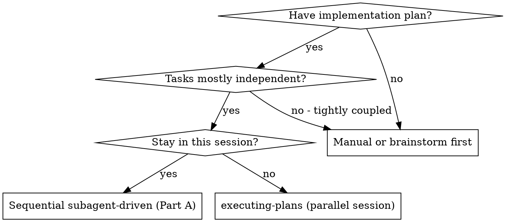
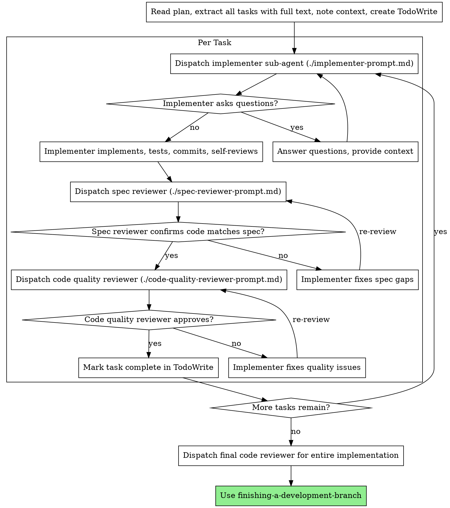
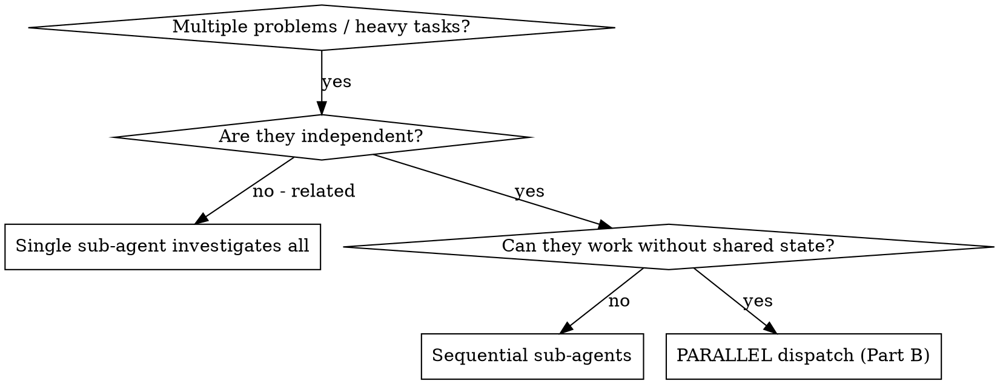
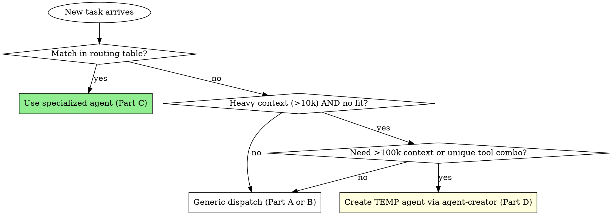

# Subagent-Driven Development (Sequential + Parallel + Routing + Temp Agents)

This skill replaces the former `subagent-driven-development` and `dispatching-parallel-agents` skills. It covers FOUR modes:

- **Part A — Sequential mode** — execute an implementation plan task-by-task with one fresh sub-agent per task plus two-stage review (spec compliance, then code quality).
- **Part B — Parallel mode** — dispatch multiple independent sub-agents concurrently to investigate / fix / build unrelated problem domains.
- **Part C — Specialized agent routing** — pick the RIGHT existing specialized sub-agent for the task (BigQuery? Confluence? Jira? Databricks? QA?) instead of defaulting to a generic implementer.
- **Part D — Temporary sub-agent creation** — when no existing agent fits AND the job needs huge context (1M tokens, mega-doc dives, giant log analysis), spin up a throwaway agent via `agent-creator`, use it once, then clean up.

**Why sub-agents at all:** you delegate tasks to specialized agents with isolated context. By precisely crafting their instructions — or by picking one already purpose-built — you ensure they stay focused and succeed. They never inherit your session's context or history — you construct exactly what they need. This also preserves your own context for coordination work.

**Routing principle (read this twice):** Before dispatching any sub-agent, ask "is there already a specialized agent for this domain?" (see Part C catalog). Generic dispatch is the LAST resort, not the first.

---

## 🚨 Hard Trigger — The 10K Context Rule

**If a single task / step / investigation is estimated to consume more than ~10,000 tokens of context, you MUST dispatch a sub-agent for it. No exceptions.**

What counts toward the 10k estimate:
- Reading large files (>500 lines)
- Multi-file refactors touching 3+ files
- Large repo scans / greps that surface long results
- Long debugging traces or stack inspections
- Heavy reference docs (API specs, large schemas, vendor docs)
- Any task whose intermediate scratch work would balloon

**Why:** Doing 10k+ token tasks inline pollutes your main-session context, crowds out the orchestration view, and degrades quality on subsequent tasks. A sub-agent runs in isolation, returns a curated summary, and you stay sharp.

**When the threshold is crossed AND multiple heavy tasks are independent → use parallel mode** (see Part B below). One sub-agent per problem domain, all dispatched concurrently.

This rule is also enforced upstream by `writing-plans` (each step is pre-tagged) and downstream by `executing-plans` (mid-flight deviation if a step is discovered to be heavy). This skill is the destination both of them route to.

---

## Part A — Sequential Subagent-Driven Development

Execute an implementation plan by dispatching a fresh sub-agent per task, with two-stage review after each: **spec compliance review FIRST, then code quality review**.

**Core principle:** Fresh sub-agent per task + two-stage review (spec then quality) = high quality, fast iteration.

### When to Use Sequential Mode



### The Process



### Model Selection

Use the least powerful model that can handle each role to conserve cost and increase speed.

| Task class | Model |
|---|---|
| Mechanical implementation (1–2 files, complete spec) | Fast / cheap model |
| Integration & judgment (multi-file, debugging) | Standard model |
| Architecture, design, review | Most capable available |

### Handling Implementer Status

Implementer sub-agents report one of four statuses:

- **DONE** — proceed to spec compliance review.
- **DONE_WITH_CONCERNS** — read concerns; address correctness/scope issues before review; merely observational concerns can be noted and you proceed.
- **NEEDS_CONTEXT** — provide the missing context and re-dispatch.
- **BLOCKED** — assess the blocker:
  1. Context problem → provide more context, re-dispatch with same model
  2. Needs more reasoning → re-dispatch with a more capable model
  3. Task too large → break it into smaller pieces (and re-evaluate against the 10k rule)
  4. Plan itself is wrong → escalate to the human

**Never** ignore an escalation or force the same model to retry without changes.

### Prompt Templates

- `./implementer-prompt.md` — implementer sub-agent dispatch
- `./spec-reviewer-prompt.md` — spec compliance reviewer dispatch
- `./code-quality-reviewer-prompt.md` — code quality reviewer dispatch

### Sequential Mode Red Flags

- ❌ Start implementation on `main`/`master` without explicit user consent
- ❌ Skip either review (spec OR quality)
- ❌ Proceed with unfixed issues
- ❌ Dispatch multiple implementer sub-agents in parallel for the SAME task (conflicts) — parallelism is for INDEPENDENT domains; see Part B
- ❌ Make sub-agent read the plan file (provide the full task text instead)
- ❌ Skip scene-setting context
- ❌ Ignore sub-agent questions
- ❌ Accept "close enough" on spec compliance
- ❌ Start code quality review BEFORE spec compliance is ✅ (wrong order)
- ❌ Move to next task while either review has open issues

---

## Part B — Parallel Sub-Agent Dispatch

When you face **2+ independent tasks/failures/investigations** that share no state, dispatching them sequentially wastes wall-clock time. Dispatch one sub-agent per problem domain, run them concurrently.

**Core principle:** One sub-agent per independent problem domain. Let them work concurrently.

### When to Use Parallel Mode



**Use parallel mode when:**
- 3+ test files failing with different root causes
- Multiple subsystems broken independently
- Multiple heavy sub-tasks (each over the 10k context threshold) that don't depend on each other
- Each problem can be understood without context from the others
- No shared state between investigations

**Don't use parallel mode when:**
- Failures are related (fixing one might fix others)
- Need to understand full system state
- Sub-agents would interfere with each other (editing same files, racing on same resources)

### The Pattern

#### 1. Identify Independent Domains

Group failures/tasks by what's broken or what's being built:
- Domain A: tool approval flow
- Domain B: batch completion behavior
- Domain C: abort functionality

Each domain is independent — fixing tool approval doesn't affect abort tests.

#### 2. Create Focused Sub-Agent Tasks

Each sub-agent gets:
- **Specific scope** — one test file or one subsystem
- **Clear goal** — what success looks like
- **Constraints** — what NOT to touch
- **Expected output** — a summary of root cause + changes made

#### 3. Dispatch in Parallel

In a single tool-call wave, fire all the sub-agents at once:

```
invoke_agent(... "Fix agent-tool-abort.test.ts failures" ...)
invoke_agent(... "Fix batch-completion-behavior.test.ts failures" ...)
invoke_agent(... "Fix tool-approval-race-conditions.test.ts failures" ...)
```

All three run concurrently.

#### 4. Review and Integrate

When sub-agents return:
1. Read each summary
2. Verify fixes don't conflict (did any two sub-agents touch the same file?)
3. Run the full test suite / verification
4. Integrate all changes

### Good Sub-Agent Prompt Structure

A good parallel-dispatch prompt is:
1. **Focused** — one clear problem domain
2. **Self-contained** — all context the sub-agent needs to understand the problem
3. **Specific about output** — what summary should it return?

Example:
```markdown
Fix the 3 failing tests in src/agents/agent-tool-abort.test.ts:

1. "should abort tool with partial output capture" — expects 'interrupted at' in message
2. "should handle mixed completed and aborted tools" — fast tool aborted instead of completed
3. "should properly track pendingToolCount" — expects 3 results but gets 0

These look like timing / race condition issues. Your task:

1. Read the test file and understand what each test verifies
2. Identify root cause — timing issues or actual bugs?
3. Fix by:
   - Replacing arbitrary timeouts with event-based waiting
   - Fixing bugs in abort implementation if found
   - Adjusting test expectations if testing changed behavior

Do NOT just increase timeouts — find the real issue.
Do NOT touch any other test file.

Return: Summary of what you found and what you fixed.
```

### Parallel Mode Common Mistakes

| ❌ Mistake | ✅ Fix |
|---|---|
| "Fix all the tests" | "Fix `agent-tool-abort.test.ts`" — one focused scope |
| No context | Paste error messages and test names |
| No constraints | "Do NOT change production code" / "Tests only" |
| Vague output | "Return summary of root cause and changes" |

### When NOT to Parallelize

- **Related failures** — investigate together first; fixing one might fix others
- **Need full context** — understanding requires seeing the entire system
- **Exploratory debugging** — you don't yet know what's broken
- **Shared state** — sub-agents would interfere (same files, same resources)

### Verification After Parallel Dispatch

1. **Read each summary** — understand what changed
2. **Check for conflicts** — did any two sub-agents edit the same code?
3. **Run full suite** — verify all fixes work together
4. **Spot check** — sub-agents can make systematic errors

### Real-World Impact

From a debugging session:
- 6 failures across 3 files
- 3 sub-agents dispatched in parallel
- All investigations completed concurrently
- All fixes integrated successfully
- Zero conflicts between sub-agent changes
- ~3× wall-clock speedup vs sequential

---

---

## Part C — Specialized Agent Routing (Pick the Right Sub-Agent)

Before you dispatch a generic implementer, **check if the agent platform already has a purpose-built sub-agent for the domain**. Specialized agents come with the right tools, credentials, prompts, and tribal knowledge baked in — a generic agent will waste tokens reinventing them.

### Routing Table — Common Task → Sub-Agent

| If the task involves… | Invoke this agent | Notes |
|---|---|---|
| Querying BigQuery, dataset/table exploration, SQL on GCP | `bigquery-explorer` | Knows your BQ projects & auth |
| Finding which AD group / table grants BQ access | `bq-ad-group-locator` | Searches Confluence + access-rights tables |
| Searching Confluence docs / runbooks | `confluence-search` | Use BEFORE guessing internal conventions |
| Reading internal Developer Portal docs | `dx-docs` | Internal API/SDK reference |
| Jira tickets — search, create, update, transition | `jira` | |
| Databricks notebooks, jobs, PySpark, SQL warehouses | `databricks` | |
| Power BI workspaces, reports, DAX | `powerbi` | |
| Microsoft 365 — mail, calendar, files, Teams | `msgraph` | |
| Pete (enterprise DB web service), Instant APIs, CIDs | `pete` | |
| Multi-source data analytics (BQ + Databricks + Confluence + PowerBI) | `data-analytics` | One-stop shop when crossing data sources |
| Web UI / E2E testing with Playwright + visual analysis | `qa-kitten` | |
| Terminal / TUI app testing with visual analysis | `terminal-qa` | |
| Risk-based QA planning, coverage gaps, release readiness | `qa-expert` | |
| Holistic code review (any language) | `code-reviewer` | Default reviewer |
| Python code review | `python-reviewer` | |
| TypeScript code review | `typescript-reviewer` | |
| JavaScript code review | `javascript-reviewer` | |
| Go code review | `golang-reviewer` | |
| C code review | `c-reviewer` | |
| C++ code review | `cpp-reviewer` | |
| iOS / Swift / SwiftUI review | `ios-reviewer` | |
| Modern Python implementation (async, typed, frameworks) | `python-programmer` | Prefer over generic for Python work |
| Security audit, threat modeling, remediation | `security-auditor` | |
| Prompt quality analysis | `prompt-reviewer` | |
| PRDs, user stories, program tracking | `tpm` | |
| Breaking a complex task into actionable steps | `planning-agent` | Often the FIRST agent to invoke |
| Creating a NEW persistent JSON agent config | `agent-creator` | Also used for temp agents — see Part D |
| Scheduling recurring prompts (daily reports, code reviews) | `scheduler-agent` | |
| Publishing HTML/reports to a sharing host | `share-puppy` | |
| Building HTML slidedecks | `slide-creator` | |
| Retail store KPI anomaly detection | `store-anomaly-detector` | |

### Routing Decision Flow



### Routing Red Flags

- ❌ Asking the generic implementer to write SQL when `bigquery-explorer` exists
- ❌ Manually grepping Confluence URLs instead of invoking `confluence-search`
- ❌ Dispatching a generic Python coder when `python-programmer` is available
- ❌ Reviewing TypeScript with the generic `code-reviewer` when `typescript-reviewer` is sharper
- ❌ Skipping `planning-agent` on a complex multi-step task and improvising the plan inline
- ❌ Always defaulting to `data-analytics` when a single-source agent would suffice (it's heavier)

### Discovering New Agents

The agent roster grows. Before you assume "there's no agent for this," run `list_agents` and read descriptions. If you find a fit not in the table above, **update this skill's routing table in the same PR** so the next caller benefits.

---

## Part D — Temporary Sub-Agents for Large-Context Jobs

Sometimes the job genuinely doesn't fit any existing agent AND blows past normal context budgets — think 1M-token vendor doc dives, multi-hundred-MB log triage, scanning a mega-monorepo, or one-shot tasks needing a unique tool combination. In those cases, **spin up a throwaway agent via `agent-creator`, use it once, then clean it up.**

### When to Create a Temp Agent

Use the temp-agent path when ALL of these hold:

1. No existing agent in Part C's routing table fits.
2. Generic Part A/B dispatch would either (a) blow past context limits, or (b) need a custom toolset / model pin you can't get from the general-purpose template.
3. The need is **one-shot or short-lived** — not a recurring workflow (recurring → make it a permanent agent and add it to the Part C table).

### Creation Recipe

Dispatch `agent-creator` with the minimum inputs:

```
invoke_agent(
  agent_name="agent-creator",
  prompt="""
  Create a TEMPORARY agent for a one-shot job.

  Name: temp-<purpose-kebab-case>-<unix_timestamp>
  Description: TEMPORARY — <one-line purpose>. Safe to delete after use.
  Purpose: <what it should do, in 2-3 sentences>
  Tools needed: <list, or 'suggest based on purpose'>
  Model pin: <e.g. gemini-3.1-pro-preview-long for 1M ctx, gpt-5.5 for 272k, or omit>
  """
)
```

`agent-creator` writes the JSON config to `~/.code_puppy/agents/<name>.json` and returns the agent name.

### Naming Convention (Mandatory for Temp Agents)

- Format: `temp-<purpose>-<unix_timestamp>` (kebab-case)
- Example: `temp-vendor-api-doc-dive-1715441600`
- The literal word `"temporary"` MUST appear in the agent's `description` field so cleanup scripts can grep for it.

### Model Pinning for Long Context

| Need | Pin |
|---|---|
| ~1M-token reads (giant docs, full repo scan) | `gemini-3.1-pro-preview-long` |
| ~272k context, strong reasoning | `gpt-5.5` |
| Default / unsure | leave unpinned (caller's default) |

### Invoke and Then Clean Up

```
# 1. Use it
invoke_agent(agent_name="temp-vendor-api-doc-dive-1715441600", prompt="...")

# 2. Read the curated summary it returns
# 3. Clean up the JSON config
delete_file("/Users/<you>/.code_puppy/agents/temp-vendor-api-doc-dive-1715441600.json")
```

Cleanup is the caller's responsibility. Leftover temp agents pollute `list_agents` output and confuse future routing decisions.

### Promoting a Temp Agent

If you find yourself creating the same temp agent twice, that's a signal: **promote it to a permanent agent**. Have `agent-creator` rebuild it with a non-temp name, add a row to the Part C routing table in the same PR, and submit it.

### Temp-Agent Red Flags

- ❌ Creating a temp agent when a Part C specialized agent would have worked
- ❌ Forgetting to delete the JSON config after use
- ❌ Naming a temp agent without the `temp-` prefix or the timestamp
- ❌ Pinning a long-context model "just in case" when the job is small (waste of $$)
- ❌ Creating temp agents in parallel without unique timestamps (collisions)
- ❌ Recurring use of the same temp agent without promoting it to permanent

---

## Combined Workflow: When Sequential Meets Parallel

Most real plans mix the four modes. Typical pattern:

1. `writing-plans` produces a plan; each step is tagged with estimated context size + a parallel-safe flag + (optionally) a suggested specialized agent.
2. `executing-plans` walks the plan; for each step, route in this order:
   - **First, check Part C routing table.** If a specialized agent fits the domain (BigQuery, Confluence, Jira, Databricks, code review by language, etc.), use it — regardless of estimated context size.
   - If no specialized agent fits AND estimated context ≤ 10k AND step isn't tagged `SUB_AGENT` → execute inline.
   - If no specialized agent fits AND estimated context > 10k OR step is tagged `SUB_AGENT` → dispatch via Part A (sequential, with two-stage review).
   - If a contiguous batch of steps is independent AND each is heavy → dispatch via Part B (parallel) — still preferring specialized agents from Part C inside the batch.
   - If the step needs >100k context, exotic tooling, or a model the standard template can't pin → spin up a temp agent via Part D, use it once, delete it.

The 10k rule is the universal trigger that routes work into this skill. The Part C catalog is the universal lookup that prevents reinventing wheels.

---

## Integration

**Required workflow skills:**
- **using-git-worktrees** — REQUIRED: set up isolated workspace before starting (especially for parallel mode, to avoid same-checkout conflicts)
- **writing-plans** — creates the plan this skill executes; tags heavy steps for sub-agent dispatch
- **executing-plans** — the harness that calls this skill on heavy steps
- **code-review** — used by spec & quality reviewer sub-agents in Part A
- **finishing-a-development-branch** — complete development after all tasks

**Specialized & meta agents this skill routes to (Parts C & D):**
- `bigquery-explorer`, `bq-ad-group-locator`, `confluence-search`, `dx-docs`, `jira`, `databricks`, `powerbi`, `msgraph`, `pete`, `data-analytics`, `qa-kitten`, `terminal-qa`, `qa-expert`, `code-reviewer`, `python-reviewer`, `typescript-reviewer`, `javascript-reviewer`, `golang-reviewer`, `c-reviewer`, `cpp-reviewer`, `ios-reviewer`, `python-programmer`, `security-auditor`, `prompt-reviewer`, `tpm`, `planning-agent`, `scheduler-agent`, `share-puppy`, `slide-creator`, `store-anomaly-detector`
- `agent-creator` — used by Part D to spin up temporary agents for one-shot large-context jobs

**Sub-agents should themselves use:**
- **test-driven-development** — sub-agents follow TDD for each task
- **systematic-debugging** — for any failure / regression a sub-agent encounters
