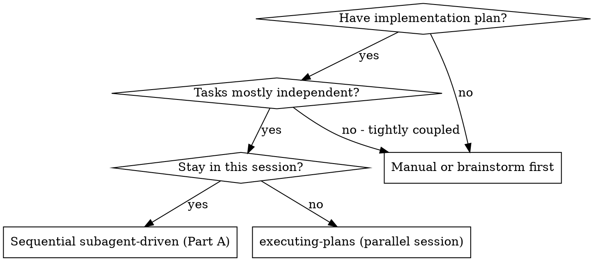
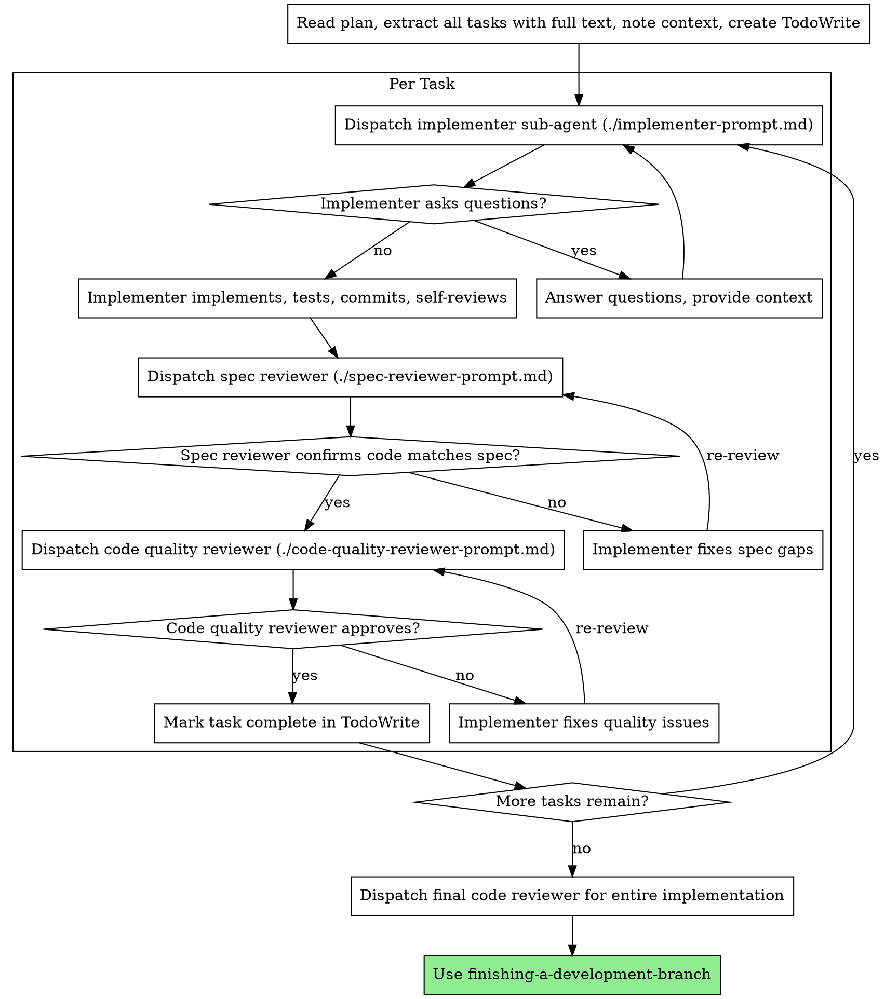
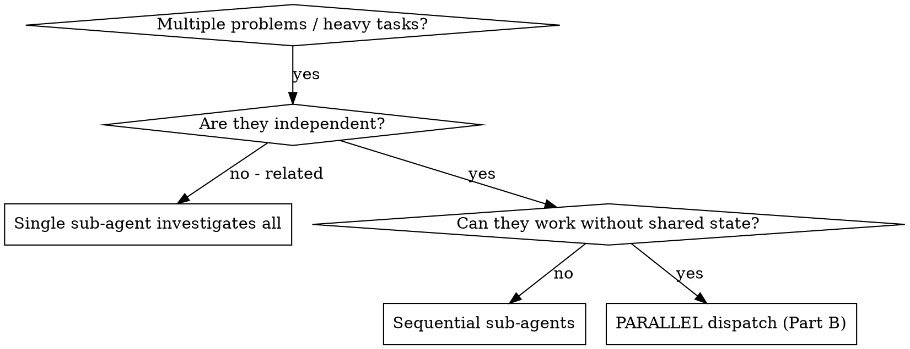
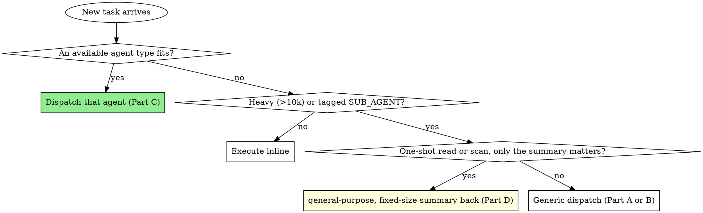

# Subagent-Driven Development (Sequential + Parallel + Routing + Temp Agents)

This skill replaces the former `subagent-driven-development` and `dispatching-parallel-agents` skills. It covers FOUR modes:

- **Part A — Sequential mode** — execute an implementation plan task-by-task with one fresh sub-agent per task plus two-stage review (spec compliance, then code quality).
- **Part B — Parallel mode** — dispatch multiple independent sub-agents concurrently to investigate / fix / build unrelated problem domains.
- **Part C — Agent routing** — pick the agent type that fits the task (a read-only search agent, a planning agent, a project or plugin agent written for the domain) instead of defaulting to a generic implementer.
- **Part D — One-shot large-context jobs** — when nothing fits AND the job is a huge one-off read (giant logs, full API references, monorepo scans), hand it to one general-purpose sub-agent that returns only a summary; nothing to create or clean up.

**Why sub-agents at all:** you delegate tasks to specialized agents with isolated context. By precisely crafting their instructions — or by picking one already purpose-built — you ensure they stay focused and succeed. They never inherit your session's context or history — you construct exactly what they need. This also preserves your own context for coordination work.

**Routing principle (read this twice):** Before dispatching any sub-agent, ask "is there already an agent type for this domain?" (see Part C). Generic dispatch is the LAST resort, not the first.

---

## 🚨 Hard Trigger — The 10K Context Rule

**If a single task / step / investigation is estimated to consume more than ~10,000 tokens of context, you MUST dispatch a sub-agent for it. No exceptions.**

What counts toward the 10k estimate:
- Reading large files (>500 lines)
- Multi-file refactors touching 3+ files
- Large repo scans / greps that surface long results
- Long debugging traces or stack inspections
- Heavy reference docs (API specs, large schemas, vendor docs)
- Any task whose intermediate scratch work would balloon

**Why:** Doing 10k+ token tasks inline pollutes your main-session context, crowds out the orchestration view, and degrades quality on subsequent tasks. A sub-agent runs in isolation, returns a curated summary, and you stay sharp.

**When the threshold is crossed AND multiple heavy tasks are independent → use parallel mode** (see Part B below). One sub-agent per problem domain, all dispatched concurrently.

This rule is also enforced upstream by `writing-plans` (each step is pre-tagged) and downstream by `executing-plans` (mid-flight deviation if a step is discovered to be heavy). This skill is the destination both of them route to.

---

## Part A — Sequential Subagent-Driven Development

Execute an implementation plan by dispatching a fresh sub-agent per task, with two-stage review after each: **spec compliance review FIRST, then code quality review**.

**Core principle:** Fresh sub-agent per task + two-stage review (spec then quality) = high quality, fast iteration.

### When to Use Sequential Mode


```dot
digraph when_to_use {
    "Have implementation plan?" [shape=diamond];
    "Tasks mostly independent?" [shape=diamond];
    "Stay in this session?" [shape=diamond];
    "Sequential subagent-driven (Part A)" [shape=box];
    "executing-plans (parallel session)" [shape=box];
    "Manual or brainstorm first" [shape=box];

    "Have implementation plan?" -> "Tasks mostly independent?" [label="yes"];
    "Have implementation plan?" -> "Manual or brainstorm first" [label="no"];
    "Tasks mostly independent?" -> "Stay in this session?" [label="yes"];
    "Tasks mostly independent?" -> "Manual or brainstorm first" [label="no - tightly coupled"];
    "Stay in this session?" -> "Sequential subagent-driven (Part A)" [label="yes"];
    "Stay in this session?" -> "executing-plans (parallel session)" [label="no"];
}
```

### The Process


```dot
digraph process {
    rankdir=TB;

    subgraph cluster_per_task {
        label="Per Task";
        "Dispatch implementer sub-agent (./implementer-prompt.md)" [shape=box];
        "Implementer asks questions?" [shape=diamond];
        "Answer questions, provide context" [shape=box];
        "Implementer implements, tests, commits, self-reviews" [shape=box];
        "Dispatch spec reviewer (./spec-reviewer-prompt.md)" [shape=box];
        "Spec reviewer confirms code matches spec?" [shape=diamond];
        "Implementer fixes spec gaps" [shape=box];
        "Dispatch code quality reviewer (./code-quality-reviewer-prompt.md)" [shape=box];
        "Code quality reviewer approves?" [shape=diamond];
        "Implementer fixes quality issues" [shape=box];
        "Mark task complete in TodoWrite" [shape=box];
    }

    "Read plan, extract all tasks with full text, note context, create TodoWrite" [shape=box];
    "More tasks remain?" [shape=diamond];
    "Dispatch final code reviewer for entire implementation" [shape=box];
    "Use finishing-a-development-branch" [shape=box style=filled fillcolor=lightgreen];

    "Read plan, extract all tasks with full text, note context, create TodoWrite" -> "Dispatch implementer sub-agent (./implementer-prompt.md)";
    "Dispatch implementer sub-agent (./implementer-prompt.md)" -> "Implementer asks questions?";
    "Implementer asks questions?" -> "Answer questions, provide context" [label="yes"];
    "Answer questions, provide context" -> "Dispatch implementer sub-agent (./implementer-prompt.md)";
    "Implementer asks questions?" -> "Implementer implements, tests, commits, self-reviews" [label="no"];
    "Implementer implements, tests, commits, self-reviews" -> "Dispatch spec reviewer (./spec-reviewer-prompt.md)";
    "Dispatch spec reviewer (./spec-reviewer-prompt.md)" -> "Spec reviewer confirms code matches spec?";
    "Spec reviewer confirms code matches spec?" -> "Implementer fixes spec gaps" [label="no"];
    "Implementer fixes spec gaps" -> "Dispatch spec reviewer (./spec-reviewer-prompt.md)" [label="re-review"];
    "Spec reviewer confirms code matches spec?" -> "Dispatch code quality reviewer (./code-quality-reviewer-prompt.md)" [label="yes"];
    "Dispatch code quality reviewer (./code-quality-reviewer-prompt.md)" -> "Code quality reviewer approves?";
    "Code quality reviewer approves?" -> "Implementer fixes quality issues" [label="no"];
    "Implementer fixes quality issues" -> "Dispatch code quality reviewer (./code-quality-reviewer-prompt.md)" [label="re-review"];
    "Code quality reviewer approves?" -> "Mark task complete in TodoWrite" [label="yes"];
    "Mark task complete in TodoWrite" -> "More tasks remain?";
    "More tasks remain?" -> "Dispatch implementer sub-agent (./implementer-prompt.md)" [label="yes"];
    "More tasks remain?" -> "Dispatch final code reviewer for entire implementation" [label="no"];
    "Dispatch final code reviewer for entire implementation" -> "Use finishing-a-development-branch";
}
```

### Model Selection

Use the least powerful model that can handle each role to conserve cost and increase speed.

| Task class | Model |
|---|---|
| Mechanical implementation (1–2 files, complete spec) | Fast / cheap model |
| Integration & judgment (multi-file, debugging) | Standard model |
| Architecture, design, review | Most capable available |

### Handling Implementer Status

Implementer sub-agents report one of four statuses:

- **DONE** — proceed to spec compliance review.
- **DONE_WITH_CONCERNS** — read concerns; address correctness/scope issues before review; merely observational concerns can be noted and you proceed.
- **NEEDS_CONTEXT** — provide the missing context and re-dispatch.
- **BLOCKED** — assess the blocker:
  1. Context problem → provide more context, re-dispatch with same model
  2. Needs more reasoning → re-dispatch with a more capable model
  3. Task too large → break it into smaller pieces (and re-evaluate against the 10k rule)
  4. Plan itself is wrong → escalate to the human

**Never** ignore an escalation or force the same model to retry without changes.

### Prompt Templates

- `./implementer-prompt.md` — implementer sub-agent dispatch
- `./spec-reviewer-prompt.md` — spec compliance reviewer dispatch
- `./code-quality-reviewer-prompt.md` — code quality reviewer dispatch

### Sequential Mode Red Flags

- ❌ Start implementation on `main`/`master` without explicit user consent
- ❌ Skip either review (spec OR quality)
- ❌ Proceed with unfixed issues
- ❌ Dispatch multiple implementer sub-agents in parallel for the SAME task (conflicts) — parallelism is for INDEPENDENT domains; see Part B
- ❌ Make sub-agent read the plan file (provide the full task text instead)
- ❌ Skip scene-setting context
- ❌ Ignore sub-agent questions
- ❌ Accept "close enough" on spec compliance
- ❌ Start code quality review BEFORE spec compliance is ✅ (wrong order)
- ❌ Move to next task while either review has open issues

---

## Part B — Parallel Sub-Agent Dispatch

When you face **2+ independent tasks/failures/investigations** that share no state, dispatching them sequentially wastes wall-clock time. Dispatch one sub-agent per problem domain, run them concurrently.

**Core principle:** One sub-agent per independent problem domain. Let them work concurrently.

### When to Use Parallel Mode


```dot
digraph parallel_when {
    "Multiple problems / heavy tasks?" [shape=diamond];
    "Are they independent?" [shape=diamond];
    "Single sub-agent investigates all" [shape=box];
    "Can they work without shared state?" [shape=diamond];
    "Sequential sub-agents" [shape=box];
    "PARALLEL dispatch (Part B)" [shape=box];

    "Multiple problems / heavy tasks?" -> "Are they independent?" [label="yes"];
    "Are they independent?" -> "Single sub-agent investigates all" [label="no - related"];
    "Are they independent?" -> "Can they work without shared state?" [label="yes"];
    "Can they work without shared state?" -> "PARALLEL dispatch (Part B)" [label="yes"];
    "Can they work without shared state?" -> "Sequential sub-agents" [label="no"];
}
```

**Use parallel mode when:**
- 3+ test files failing with different root causes
- Multiple subsystems broken independently
- Multiple heavy sub-tasks (each over the 10k context threshold) that don't depend on each other
- Each problem can be understood without context from the others
- No shared state between investigations

**Don't use parallel mode when:**
- Failures are related (fixing one might fix others)
- Need to understand full system state
- Sub-agents would interfere with each other (editing same files, racing on same resources)

### The Pattern

#### 1. Identify Independent Domains

Group failures/tasks by what's broken or what's being built:
- Domain A: tool approval flow
- Domain B: batch completion behavior
- Domain C: abort functionality

Each domain is independent — fixing tool approval doesn't affect abort tests.

#### 2. Create Focused Sub-Agent Tasks

Each sub-agent gets:
- **Specific scope** — one test file or one subsystem
- **Clear goal** — what success looks like
- **Constraints** — what NOT to touch
- **Expected output** — a summary of root cause + changes made

#### 3. Dispatch in Parallel

In a single message, send one Agent tool call per domain:

```
Agent(description="Fix abort tests",    prompt="Fix agent-tool-abort.test.ts failures …")
Agent(description="Fix batch tests",    prompt="Fix batch-completion-behavior.test.ts failures …")
Agent(description="Fix approval races", prompt="Fix tool-approval-race-conditions.test.ts failures …")
```

All three run concurrently. If they edit files, give each a scope that cannot overlap (or its own git worktree).

#### 4. Review and Integrate

When sub-agents return:
1. Read each summary
2. Verify fixes don't conflict (did any two sub-agents touch the same file?)
3. Run the full test suite / verification
4. Integrate all changes

### Good Sub-Agent Prompt Structure

A good parallel-dispatch prompt is:
1. **Focused** — one clear problem domain
2. **Self-contained** — all context the sub-agent needs to understand the problem
3. **Specific about output** — what summary should it return?

Example:
```markdown
Fix the 3 failing tests in src/agents/agent-tool-abort.test.ts:

1. "should abort tool with partial output capture" — expects 'interrupted at' in message
2. "should handle mixed completed and aborted tools" — fast tool aborted instead of completed
3. "should properly track pendingToolCount" — expects 3 results but gets 0

These look like timing / race condition issues. Your task:

1. Read the test file and understand what each test verifies
2. Identify root cause — timing issues or actual bugs?
3. Fix by:
   - Replacing arbitrary timeouts with event-based waiting
   - Fixing bugs in abort implementation if found
   - Adjusting test expectations if testing changed behavior

Do NOT just increase timeouts — find the real issue.
Do NOT touch any other test file.

Return: Summary of what you found and what you fixed.
```

### Parallel Mode Common Mistakes

| ❌ Mistake | ✅ Fix |
|---|---|
| "Fix all the tests" | "Fix `agent-tool-abort.test.ts`" — one focused scope |
| No context | Paste error messages and test names |
| No constraints | "Do NOT change production code" / "Tests only" |
| Vague output | "Return summary of root cause and changes" |

### When NOT to Parallelize

- **Related failures** — investigate together first; fixing one might fix others
- **Need full context** — understanding requires seeing the entire system
- **Exploratory debugging** — you don't yet know what's broken
- **Shared state** — sub-agents would interfere (same files, same resources)

### Verification After Parallel Dispatch

1. **Read each summary** — understand what changed
2. **Check for conflicts** — did any two sub-agents edit the same code?
3. **Run full suite** — verify all fixes work together
4. **Spot check** — sub-agents can make systematic errors

### Real-World Impact

From a debugging session:
- 6 failures across 3 files
- 3 sub-agents dispatched in parallel
- All investigations completed concurrently
- All fixes integrated successfully
- Zero conflicts between sub-agent changes
- ~3× wall-clock speedup vs sequential

---

---

## Part C — Agent Routing (Pick the Right Sub-Agent)

Before you dispatch a general-purpose sub-agent, **check whether an agent type built for the job is available.** The Agent tool lists every type this session can dispatch, each with a description saying when to use it: Claude Code's built-in types, plus any agents defined in the project's `.claude/agents/`, in your `~/.claude/agents/`, or by an installed plugin. A specialized agent comes with the right tools and instructions already in place; a generic one has to rediscover them on your tokens.

### Routing Table — Common Task → Agent Type

The built-in types vary with the Claude Code version, so read the Agent tool's list rather than assuming; these are the usual ones.

| If the task is… | Dispatch | Why |
|---|---|---|
| Finding where something lives across many files; a broad read-only search | `Explore` | Read-only; returns locations and conclusions, not file dumps |
| Designing an implementation approach before any code is written | `Plan` | Returns steps and the files involved; makes no edits |
| A domain an agent in `.claude/agents/` or a plugin was written for (a database, a ticket system, a docs search, a reviewer for one language) | that agent | It already carries the domain's tools and conventions |
| Implementation, debugging, anything that edits — and nothing above fits | `general-purpose` | Brief it with Part A's prompt templates |

### Routing Decision Flow


```dot
digraph routing {
    "New task arrives" [shape=oval];
    "An available agent type fits?" [shape=diamond];
    "Dispatch that agent (Part C)" [shape=box style=filled fillcolor=lightgreen];
    "Heavy (>10k) or tagged SUB_AGENT?" [shape=diamond];
    "Execute inline" [shape=box];
    "One-shot read or scan, only the summary matters?" [shape=diamond];
    "general-purpose, fixed-size summary back (Part D)" [shape=box style=filled fillcolor=lightyellow];
    "Generic dispatch (Part A or B)" [shape=box];

    "New task arrives" -> "An available agent type fits?";
    "An available agent type fits?" -> "Dispatch that agent (Part C)" [label="yes"];
    "An available agent type fits?" -> "Heavy (>10k) or tagged SUB_AGENT?" [label="no"];
    "Heavy (>10k) or tagged SUB_AGENT?" -> "Execute inline" [label="no"];
    "Heavy (>10k) or tagged SUB_AGENT?" -> "One-shot read or scan, only the summary matters?" [label="yes"];
    "One-shot read or scan, only the summary matters?" -> "general-purpose, fixed-size summary back (Part D)" [label="yes"];
    "One-shot read or scan, only the summary matters?" -> "Generic dispatch (Part A or B)" [label="no"];
}
```

### Routing Red Flags

- ❌ Sending a general-purpose agent to search a codebase when a read-only search type (`Explore`) is available
- ❌ Hand-rolling access to a system (database, tickets, docs) when a project or plugin agent already wraps it
- ❌ Reviewing code with a generic agent when a reviewer for that language is defined
- ❌ Improvising the plan for a complex multi-step task inline when a planning type is available
- ❌ Picking an agent by its name alone — its description says when to use it; read that

### Adding an Agent

If you keep writing the same long brief for the same kind of job, make it a permanent agent: a Markdown file at `.claude/agents/<name>.md` (shared with the project) or `~/.claude/agents/<name>.md` (yours alone). Its frontmatter carries `name`, `description` (when to use it — this is what routing reads), and optionally `tools` and `model`; the body is the agent's instructions. The `/agents` command creates one interactively. If a new agent does not appear in the Agent tool's list, start a new session.

---

## Part D — One-Shot Large-Context Jobs

Some jobs are one-off and huge: a vendor's full API reference, a multi-hundred-MB log, a scan of a large monorepo. No existing agent fits and none is worth creating. **Dispatch one `general-purpose` sub-agent with a self-contained brief.** Every dispatch starts in a fresh context, does its reading there, and hands back only what you asked for — the bulk never enters your session, and there is nothing to create or clean up afterwards.

### How to Brief It

- State the question the read must answer, not just "read X".
- Name the sources (paths, URLs, globs) and what to skip.
- Fix the return shape and its size — e.g. "Return at most 30 lines: the answer first, then `file:line` evidence for each claim."
- Say what it must not do (edit files, call the network, …) when that matters.

### Model Choice

An agent file's `model` field — or a per-call model override, where the Agent tool offers one — picks the model for that sub-agent. A faster model suits a mechanical sweep; the most capable one suits judgement-heavy synthesis. When unsure, leave it unset and the session's default applies.

### Promote What Recurs

If the same one-shot brief comes back a second time, turn it into a permanent agent (Part C, "Adding an Agent").

### One-Shot Red Flags

- ❌ Reading the huge source in the main session "just to skim it" first
- ❌ A brief with no limit on what comes back — the summary then floods your context instead
- ❌ A one-shot dispatch when an available agent type already covers the job (Part C)
- ❌ Splitting one coherent read across parallel agents that each need the whole picture

---

## Combined Workflow: When Sequential Meets Parallel

Most real plans mix the four modes. Typical pattern:

1. `writing-plans` produces a plan; each step is tagged with estimated context size + a parallel-safe flag + (optionally) a suggested specialized agent.
2. `executing-plans` walks the plan; for each step, route in this order:
   - **First, check the available agent types (Part C).** If one fits the domain (search, planning, a project or plugin agent, a reviewer for the language), use it — regardless of estimated context size.
   - If no specialized agent fits AND estimated context ≤ 10k AND step isn't tagged `SUB_AGENT` → execute inline.
   - If no specialized agent fits AND estimated context > 10k OR step is tagged `SUB_AGENT` → dispatch via Part A (sequential, with two-stage review).
   - If a contiguous batch of steps is independent AND each is heavy → dispatch via Part B (parallel) — still preferring agent types from Part C inside the batch.
   - If the step is a one-shot huge read or scan where only the conclusion matters → Part D: one general-purpose sub-agent, a fixed-size summary back.

The 10k rule is the universal trigger that routes work into this skill. Checking the available agent types first is what prevents reinventing wheels.

---

## Integration

**Required workflow skills:**
- **using-git-worktrees** — REQUIRED: set up isolated workspace before starting (especially for parallel mode, to avoid same-checkout conflicts)
- **writing-plans** — creates the plan this skill executes; tags heavy steps for sub-agent dispatch
- **executing-plans** — the harness that calls this skill on heavy steps
- **code-review** — used by spec & quality reviewer sub-agents in Part A
- **finishing-a-development-branch** — complete development after all tasks

**Agent types this skill routes to (Parts C & D):** whatever the Agent tool lists — the built-in types (usually `general-purpose`, `Explore`, `Plan`) plus agents defined in `.claude/agents/`, `~/.claude/agents/` and installed plugins.

**Sub-agents should themselves use:**
- **test-driven-development** — sub-agents follow TDD for each task
- **systematic-debugging** — for any failure / regression a sub-agent encounters
